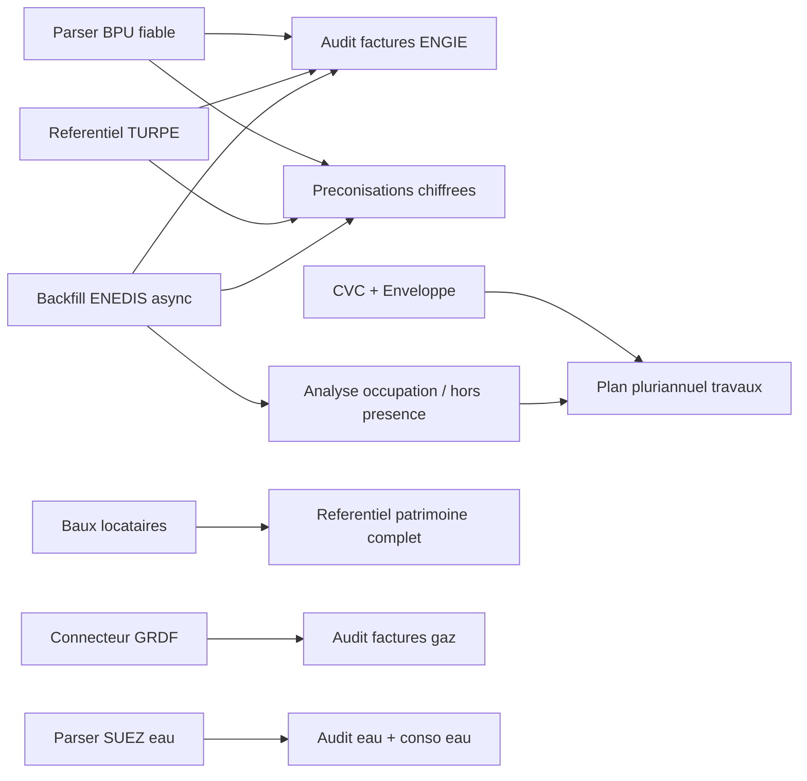

# Rapport audit projet + Obsidian - 2026-05-19

> Objet : analyser ce qui a ete developpe, ce qui reste a developper, la qualite des liaisons entre taches dans Obsidian, et proposer une feuille de route de reprise.
> Sources consultees : code `saas/backend`, code `saas/frontend`, `docs/`, `saas/specs/`, routes FastAPI, pages React, migrations Alembic, historique Git local.

## Synthese

Le projet a depasse le simple MVP patrimoine : il contient maintenant un socle SaaS exploitable avec authentification, multi-tenant par ville, inventaire bati, gestion technique, energie ENEDIS, factures, TURPE, BPU et preconisations de puissance.

Le risque principal n'est pas l'absence de travail, mais la dispersion : beaucoup de briques existent, certaines sont solides, d'autres sont partielles, et les dependances entre chantiers ne sont pas encore pilotees comme un vrai backlog produit. Obsidian est bien structure pour transmettre le contexte entre IA, mais il manque encore une couche de pilotage operationnel : IDs de taches, priorites arbitrees, dependances explicites, dates cibles, criteres d'acceptation et statut de validation.

Information utilisateur ajoutee apres audit : le poste de travail est un ordinateur entreprise sur lequel aucune installation locale de bibliotheques Python, Node ou autre dependance projet n'est possible. Les recommandations doivent donc privilegier CI, conteneurs, VPS, Codespaces ou environnement Codex deja equipe.

## Ce qui est deja developpe

| Domaine | Etat reel | Commentaire |
|---|---:|---|
| Auth / compte utilisateur | Stable | JWT, profil, mot de passe, routes front presentes. |
| Multi-tenant ville | Stable | `city_id` structure le produit ; vigilance a maintenir sur tous les nouveaux endpoints. |
| Patrimoine proprietaire | Avance | Inventaire batiments, locaux, import/consolidation DGFiP/IGN/OSM, cartes Leaflet. |
| Gestion technique | Partiel mais concret | Referentiel SYPEMI importe, assignation equipements, score sante ; pas encore scinde CVC/enveloppe. |
| ENEDIS consommation | Avance | Sync quotidien, courbe de charge, P max, DJU, audit PRM, async FTP/AES/scheduler. |
| Preconisations puissance | Avance | Page dediee, logique de recommandation, seuils metier documentes. |
| Facturation / factures | Partiel avance | Upload, parser ENGIE PDF, analyse, decisions utilisateur ; autres fournisseurs non couverts. |
| TURPE | Avance | Referentiel et controles presents, a rafraichir selon evolution CRE. |
| BPU historique | Structure solide, extraction faible | Schema 5 tables et UI presents ; parser PDF/OCR insuffisant pour exploiter les prix a grande echelle. |
| CI / deploy / infra | Present | Docker Compose prod, Caddy, GitHub Actions, Codespaces minimal. |
| Documentation Obsidian | Bonne base | Index, modules, ADR, specs cataloguees, sessions de passation. |

## Ce qui reste a developper

| Priorite produit | Chantier | Pourquoi c'est important |
|---:|---|---|
| P0 | Fiabiliser le parser BPU ou ajouter une saisie corrective | Sans prix BPU fiables, l'audit facture et les chiffrages automatiques restent incomplets. |
| P0 | Finaliser l'operationnel ENEDIS async en prod | Le backfill profond alimente les preconisations et les controles conso/factures. |
| P1 | Enrichir l'audit facture ENGIE | Le socle existe, mais il faut aligner completement la matrice de controles avec les donnees extraites. |
| P1 | Corriger la documentation des routes factures | Fait : les docs distinguent maintenant routes frontend `/energie/factures/*` et API backend `/api/billing/invoices/imports/*`. |
| P1 | Scinder Gestion technique CVC / Enveloppe | La fonctionnalite est partielle car l'UI reste generique. |
| P2 | Module baux locataires | Gros apport patrimoine, mais moins bloquant pour les modules energie. |
| P2 | GRDF gaz | Necessaire pour couvrir les fluides, reutilise l'architecture ENEDIS. |
| P2 | SUEZ eau | Upload PDF + parser, utile mais depend du choix produit sur les premiers clients. |
| P3 | Occupation / horaires batiments | Tres utile pour expliquer les surconsommations, mais doit venir apres donnees energie fiables. |
| P3 | Temperature / programmation CVC | Potentiellement fort, mais besoin de cadrage source de donnees : Excel, GTB, IoT. |

## Carte des dependances entre taches



Lecture simple : les prochains chantiers les plus structurants sont `BPU`, `ENEDIS async` et `audit facture`, car ils nourrissent plusieurs autres modules. A l'inverse, `baux`, `GRDF`, `SUEZ`, `occupation` et `temperature` sont utiles mais peuvent etre phasés ensuite sans bloquer le coeur energie electricite.

## Analyse Obsidian

### Ce qui va bien

- `docs/00-Index.md` donne un vrai point d'entree.
- Les notes `Modules/` sont utiles : elles separent le produit par domaine metier.
- Les ADR dans `docs/Decisions/` sont une bonne decision : elles evitent de cacher les choix structurants dans les sessions.
- `docs/Specs.md` clarifie quelles anciennes specs restent canoniques, partielles ou archivees.
- Les sessions documentent bien la passation IA-a-IA, avec contexte et handoff.

### Ce qui ne va pas encore

- La roadmap est descriptive, pas encore actionnable comme backlog. Elle dit "Todo" ou "Partiel", mais pas toujours "prochaine action concrete", "depend de", "critere d'acceptation", "owner", "risque".
- Les dependances entre taches sont implicites. Exemple : `BPU` bloque une partie de `Facturation` et fiabilise `Preconisations`, mais ce lien n'est pas visible dans la roadmap.
- Quelques liens Obsidian sont volontairement faux dans les templates, mais risquent de polluer le graphe : `[[Decisions/NNN-...]]`, `[[Modules/...]]`, `[[Sessions/AAAA-MM-JJ ...]]`.
- Le template session utilise `[[Décisions/...]]` alors que le dossier reel est `docs/Decisions/`. Cela cree des liens casses a cause de l'accent et du nom different.
- Une session contient un lien litteral `[[...]]`, qui n'a pas de sens dans le graphe.
- Certaines routes documentees ne correspondaient plus au code. Point corrige : les factures sont cote API sous `/api/billing/invoices/imports/*`, avec routes frontend `/energie/factures/*`.
- `04-Etat-actuel-du-dev.md` contient des informations sensibles de localisation de secrets. Les mots de passe ne sont pas affiches, mais le chemin exact et la procedure d'acces devraient etre deplaces dans une note locale non versionnee ou un gestionnaire de secrets.
- Les tests sont tres concentres sur ENEDIS. Les modules BPU, factures, TURPE, patrimoine import et frontend n'ont pas de couverture comparable.

## Recommandations

### 1. Transformer la roadmap en backlog pilotable

Ajouter a chaque chantier une fiche ou une section avec :

```md
ID: PO2-BPU-001
Statut: Todo / En cours / Bloque / Fait
Priorite: P0 / P1 / P2 / P3
Depend de: [[...]]
Debloque: [[...]]
Critere d'acceptation:
- [ ] ...
Fichiers principaux:
- ...
```

Commencer par 8 fiches seulement : BPU parser, ENEDIS async prod, audit ENGIE, CVC/enveloppe, baux, GRDF, SUEZ, occupation.

### 2. Ajouter une note "Backlog"

Fait : `docs/Backlog.md` devient le tableau de pilotage unique. La roadmap reste la vision produit, le backlog devient l'outil de decision quotidienne.

Proposition de colonnes :

| ID | Chantier | Statut | Priorite | Depend de | Debloque | Prochaine action |
|---|---|---|---|---|---|---|

### 3. Corriger les liens Obsidian qui faussent le graphe

Fait pour les templates et le lien litteral `[[...]]` repere dans la session de renommage :

- `docs/Sessions/_template.md` ne pointe plus vers `[[Décisions/...]]` ;
- les placeholders Obsidian sont desormais en code inline ;
- les exemples inexistants ne polluent plus le graphe.

### 4. Aligner docs et routes reelles

Fait : `docs/Modules/Energie-Facturation.md` distingue maintenant :

- Frontend utilisateur : `/energie/factures`
- API reelle : `/api/billing/invoices/imports`
- Service : `services/invoices.py` + `services/invoice_analysis.py`

Cela evitera aux prochaines IA de partir sur un faux endpoint.

### 5. Prioriser le prochain cycle de dev

Ordre recommande :

1. `PO2-BPU-001` - Parser BPU table-aware avec `pdfplumber`, ou saisie corrective manuelle si plus rapide.
2. `PO2-ENEDIS-001` - Confirmer backfill async prod et solder les gaps `UNFILTERED_PRM_BATCH` / `ALL_OR_NOTHING_PUBLICATION`.
3. `PO2-FACT-001` - Brancher pleinement BPU + TURPE + ENEDIS dans les controles facture ENGIE.
4. `PO2-GT-001` - Scinder CVC / Enveloppe dans l'UI existante.
5. `PO2-PAT-001` - Concevoir la table `Lease` pour les baux locataires.

### 6. Renforcer les tests la ou le risque est fort

Ajouter en priorite :

- tests parser BPU sur extraits de texte/tableaux anonymises ;
- tests `invoice_analysis.py` sur cas BPU/TURPE/conso ;
- tests routes tenant-scoped pour verifier le filtre `city_id` ;
- build frontend en CI deja present, mais ajouter au moins des tests de fonctions pures pour mapping facture ou formatage metier si possible.

### 7. Respecter la contrainte zero installation locale

Fait : `docs/07-Environnement-poste-entreprise.md` formalise le workflow adapte au poste entreprise. Toute nouvelle dependance doit etre ajoutee au repo et validee via CI/conteneur/VPS, jamais installee manuellement sur le PC utilisateur.

## Limites de verification locale

J'ai tente de lancer :

- `pytest` dans `saas/backend`
- `npm run build` dans `saas/frontend`

Les deux commandes echouent dans l'environnement local courant car `pytest` et `npm` ne sont pas disponibles dans le PATH Windows de cette session. Ce n'est pas une preuve que le projet ne build pas ; cela signifie seulement que cette analyse n'a pas pu inclure une validation runtime locale.

## Verdict

Obsidian est bien parti : il sert deja de memoire projet et de passation entre IA. Pour qu'il devienne vraiment ton outil de pilotage, il faut maintenant ajouter une couche backlog explicite et nettoyer les liens qui polluent le graphe.

Cote produit, la meilleure strategie est de consolider le coeur energie electricite avant d'ouvrir trop de nouveaux fronts. Le trio gagnant est : BPU fiable, ENEDIS async operationnel, audit facture ENGIE plus complet. Une fois ces trois briques stabilisees, les modules GRDF, SUEZ, baux et occupation seront beaucoup plus faciles a raccorder proprement.
