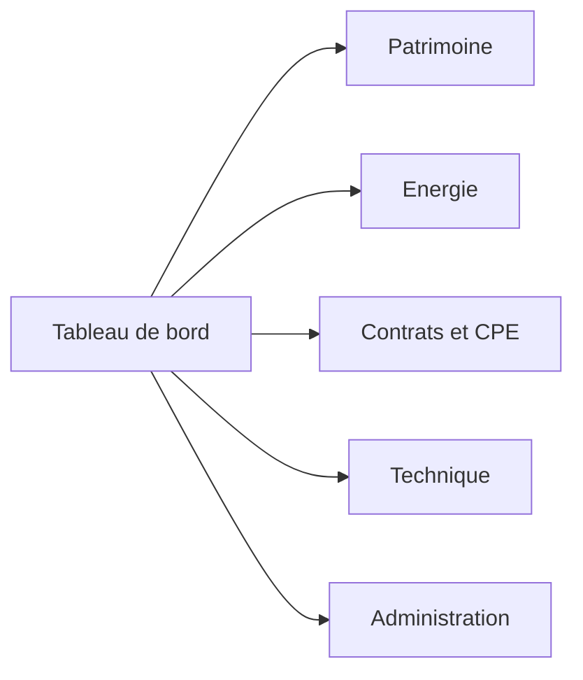
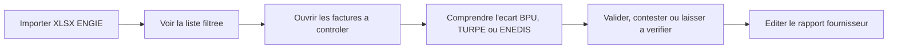
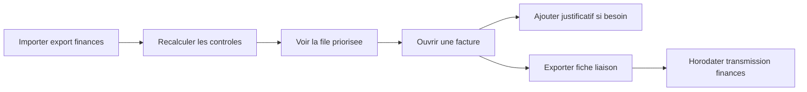
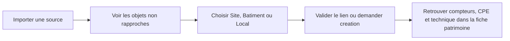

# Vision produit et navigation UX

> Document de cadrage pour revoir l'interface utilisateur de PatrimoineOp.
> Date : 2026-06-02.
> Base d'analyse : [[08-Inventaire-fonctionnalites-developpees-2026-06-02]] et navigation React actuelle.

## 1. Intention

PatrimoineOp a grandi vite. Les fonctionnalites existent, mais l'interface les expose encore comme une
collection de modules techniques. L'objectif de la refonte UX est de rendre le produit comprehensible par
un responsable patrimoine, energie ou finances sans lui demander de connaitre la structure du code, les
sources de donnees ou les noms des imports.

La navigation doit repondre a cinq questions simples :

1. Quel est mon patrimoine et que sais-je de chaque site ?
2. Ou consomme-t-on trop, ou les donnees sont-elles incompletes ?
3. Quelles factures dois-je verifier ou transmettre ?
4. Quels contrats, prix et engagements dois-je suivre ?
5. Quelles donnees dois-je importer, rapprocher ou corriger ?

## 2. Probleme de l'interface actuelle

La sidebar React actuelle expose 14 liens au meme niveau :

```text
Accueil
Batiments
Gestion Technique
Import CVC terrain
Energie
Preconisations
Factures
Facturation
Historique BPU
CPE DALKIA
Import referentiel DALKIA
Connexion
Inscription
Compte
```

Cette structure fonctionne pour developper, mais elle pose plusieurs problemes UX :

- les entrees metier, les outils d'import et les ecrans d'administration sont melanges ;
- `Batiments` ne traduit plus la hierarchie reelle `Site -> Batiment -> Local` ;
- `Factures` ne dit pas s'il s'agit des factures ENGIE ou des controles DALKIA ;
- `Facturation`, `Historique BPU`, TURPE et preconisations sont exposes comme des sujets separes alors
  qu'ils participent au meme parcours energie ;
- l'import CVC et l'import du referentiel DALKIA sont visibles en permanence, alors qu'ils servent
  ponctuellement ;
- les liens `Connexion` et `Inscription` restent affiches meme quand une session est ouverte ;
- la page `/cpe` porte a elle seule plusieurs outils : performance, imports, finance, matrice, references,
  formules, indices, factures et controles.

## 3. Utilisateurs et besoins

### 3.1 Responsable patrimoine

Objectifs :

- consulter la liste des sites, batiments et locaux ;
- enrichir une fiche patrimoine ;
- rattacher compteurs, equipements et contrats ;
- identifier les objets non rapproches ;
- preparer la maintenance, l'occupation et la conformite.

### 3.2 Responsable energie

Objectifs :

- suivre les consommations et la couverture de donnees ;
- ouvrir la fiche d'un compteur PRM ou PCE ;
- reperer les anomalies ;
- verifier les puissances souscrites ;
- controler les factures ENGIE et les prix BPU/TURPE.

### 3.3 Controleur de gestion ou service finances

Objectifs :

- traiter une file de factures a verifier ;
- comprendre pourquoi une facture est bloquee ;
- valider, refuser ou demander un justificatif ;
- exporter une fiche liaison ;
- savoir ce qui a ete transmis aux finances et quand.

### 3.4 Administrateur fonctionnel

Objectifs :

- importer les sources ;
- corriger les mappings et rapprochements ;
- maintenir les referentiels ;
- consulter les historiques d'import ;
- verifier la qualite des donnees.

Une meme personne peut cumuler plusieurs roles, mais l'interface ne doit pas lui imposer tous les outils
en permanence.

## 4. Carte produit organisee

### 4.1 Niveau 1 : domaines metier



| Domaine | Promesse utilisateur | Contenu principal |
|---|---|---|
| **Tableau de bord** | Voir les priorites du jour | alertes, anomalies, imports en attente, factures a traiter, raccourcis |
| **Patrimoine** | Connaitre et fiabiliser les biens | sites, batiments, locaux, compteurs, rapprochements |
| **Energie** | Comprendre les consommations et les factures fournisseurs | electricite, PRM, DJU, preconisations, factures ENGIE, BPU, TURPE |
| **Contrats et CPE** | Piloter les engagements contractuels DALKIA | performance CPE, factures DALKIA, controles, formules, indices, APE/P3 |
| **Technique** | Suivre l'etat des equipements | SYPEMI, inventaire terrain CVC, enveloppe, futurs occupation et BACS |
| **Administration** | Alimenter et maintenir les donnees | imports, referentiels, historique, diagnostics |

### 4.2 Niveau 2 : navigation cible

| Domaine | Entree | Fonction utilisateur | Ecrans actuels reutilisables |
|---|---|---|---|
| Tableau de bord | Vue generale | KPI et alertes transverses | `/`, a enrichir |
| Patrimoine | Sites et batiments | Explorer la cascade patrimoine | `/buildings/list` |
| Patrimoine | Carte | Visualiser le portefeuille | `/buildings` |
| Patrimoine | Rapprochements | Traiter les objets non identifies | a creer avec `PO2-PAT-003` |
| Energie | Vue d'ensemble | KPI, compteurs et qualite des donnees | `/energie` |
| Energie | Preconisations | Arbitrer les puissances souscrites | `/energie/preconisations` |
| Energie | Factures fournisseurs | Controler ENGIE puis autres fournisseurs | `/energie/factures` |
| Energie | Prix et TURPE | Lire BPU, TURPE et evolution des couts | `/energie/bpu` |
| Contrats et CPE | Tableau de bord CPE | Voir performance et engagements | `/cpe`, vue cockpit |
| Contrats et CPE | Controle factures | Traiter les factures DALKIA | `/cpe`, section controls |
| Contrats et CPE | Suivi financier | Lire l'exercice courant | `/cpe`, section invoices |
| Contrats et CPE | Formules et indices | Justifier les revisions | `/cpe`, section indices |
| Contrats et CPE | Travaux APE / P3 | Suivre obligations et demandes | a creer |
| Technique | Inventaire | Voir CVC et enveloppe par site | `/buildings/technique` |
| Technique | Etat et criticite | Prioriser les remplacements | `/buildings/technique` |
| Administration | Imports | Alimenter patrimoine, CVC, ENGIE, DALKIA | ecrans existants a regrouper |
| Administration | Referentiels | Editer BPU, configuration et matrices | `/energie/facturation`, BPU edition, matrice CPE |
| Administration | Historique et diagnostics | Verifier traitements et erreurs | imports existants, ENEDIS async |

## 5. Navigation cible proposee

### 5.1 Sidebar principale

La sidebar principale doit rester courte :

```text
Tableau de bord
Patrimoine
Energie
Contrats et CPE
Technique
Administration

Compte
Deconnexion
```

Principes :

- six domaines maximum dans la navigation principale ;
- ne pas afficher les actions d'import au premier niveau ;
- masquer `Connexion` et `Inscription` lorsqu'un utilisateur est connecte ;
- afficher le domaine actif et la page active ;
- utiliser des libelles metier stables, pas des noms de sources ou de tables.

### 5.2 Sous-navigation contextuelle

Chaque domaine dispose d'une sous-navigation :

```text
Patrimoine
  Vue d'ensemble
  Sites et batiments
  Carte
  Rapprochements

Energie
  Vue d'ensemble
  Factures fournisseurs
  Preconisations
  Prix et TURPE

Contrats et CPE
  Tableau de bord
  Controle factures
  Suivi financier
  Formules et indices
  Travaux APE / P3

Technique
  Inventaire
  CVC
  Enveloppe

Administration
  Imports
  Referentiels
  Historique et diagnostics
```

### 5.3 Espace Administration

Les imports doivent devenir des actions contextuelles ou un centre d'administration :

| Import actuel | Emplacement cible |
|---|---|
| Constitution patrimoine | `Administration > Imports > Patrimoine` et bouton contextuel depuis Patrimoine |
| Inventaire CVC terrain | `Administration > Imports > Technique` et bouton depuis Technique |
| XLSX ENGIE | `Energie > Factures fournisseurs` car c'est une action quotidienne |
| Export finances DALKIA | `Contrats et CPE > Suivi financier` car c'est une action quotidienne |
| Acte d'engagement DALKIA | `Administration > Imports > Contrats` |
| BPU canonique | `Administration > Referentiels > Prix` |

Le critere est simple : une action reguliere reste dans le parcours metier ; une action de parametrage ou
de mise a jour ponctuelle va dans Administration.

## 6. Fiche patrimoine centrale

La fiche `Site`, puis la fiche `Batiment`, doivent devenir les points de depart des analyses.

### 6.1 Fiche Site cible

```text
Resume
Batiments et locaux
Compteurs
Consommations
Factures
Technique
Contrats
Documents
Historique
```

La fiche Site sert a agreger plusieurs batiments et a raccorder les sites CPE contractuels.

### 6.2 Fiche Batiment cible

```text
Resume
Identite et sources
Locaux
Compteurs
Consommations
Factures
Equipements
Contrats
Occupation
Conformite
```

La fiche actuelle contient deja l'identite, les sources DGFiP/IGN, les locaux et les compteurs. La refonte
doit organiser ces informations en onglets ou sections progressives, puis ajouter les liens vers energie,
technique et contrats quand les rapprochements seront disponibles.

## 7. Parcours prioritaires

### 7.1 Controler les factures ENGIE



UX attendue :

- file de travail par priorite ;
- resume lisible avant le detail technique ;
- filtres avances disponibles mais repliables ;
- vocabulaire constant entre la liste, le detail et le rapport.

### 7.2 Controler les factures DALKIA



UX attendue :

- la vue `Controle factures` est l'ecran de travail principal ;
- la vue `Suivi financier` reste analytique et en lecture seule ;
- les matrices, references et indices restent accessibles sans encombrer la file quotidienne.

### 7.3 Fiabiliser le patrimoine



Ce parcours est structurant : il permet ensuite d'afficher energie, CPE et technique autour des memes
sites au lieu de conserver plusieurs listes paralleles.

## 8. Regles UX transverses

### 8.1 Distinguer trois niveaux de lecture

Chaque ecran dense doit proposer :

1. **Resume** : KPI, statut, prochain geste attendu ;
2. **Analyse** : tableaux, graphiques et filtres ;
3. **Detail technique** : lignes sources, mappings, JSON ou traces d'import si necessaire.

L'utilisateur ne doit pas traverser le detail technique pour comprendre une anomalie.

### 8.2 Faire ressortir les files de travail

Les objets a traiter doivent etre visibles depuis le tableau de bord :

- factures ENGIE a verifier ;
- factures DALKIA bloquees ou en ecart ;
- objets patrimoine non rapproches ;
- compteurs sans batiment ;
- sites CPE/DALKIA non relies ;
- imports en erreur ;
- justificatifs manquants ;
- travaux APE en retard, quand le suivi sera implemente.

### 8.3 Conserver une navigation progressive

- niveau 1 : domaine ;
- niveau 2 : parcours ;
- niveau 3 : fiche ou detail ;
- actions dangereuses ou rares dans un menu secondaire ;
- filtres avances replies par defaut sur les ecrans charges.

### 8.4 Employer un vocabulaire metier

| Terme technique actuel | Libelle UX recommande |
|---|---|
| `Building` | Batiment |
| `Site` | Site patrimonial |
| `CpeSite` | Site CPE |
| `CpeDalkiaRefSite` | Site contractuel DALKIA |
| BPU | Prix contractuels (BPU) |
| `BillingConfig` | Configuration tarifaire |
| `EnergyInvoiceImport` | Facture fournisseur importee |
| `CpeFinanceInvoice` | Facture DALKIA |
| NB / N'B | Cible contractuelle / cible corrigee |

Les sigles restent visibles, mais accompagnes d'une explication courte.

## 9. Ecrans a simplifier en priorite

| Ecran | Probleme actuel | Direction UX |
|---|---|---|
| Sidebar `App.tsx` | 14 liens plats | 6 domaines + sous-navigation |
| Accueil `/` | Peu de valeur metier | Tableau de bord transverse et files de travail |
| `/buildings/list` | Riche mais charge | Faire de la cascade patrimoine le point d'entree, avec details progressifs |
| `/buildings/:id` | Longue fiche verticale | Organiser en onglets ou sections ancrees |
| `/energie/factures` | Tres complet et dense | Presets de filtres, panneaux avances repliables |
| `/energie/bpu` | Timeline, TURPE, documents et edition melanges | Garder les onglets ; deplacer import et edition avancee vers Administration |
| `/cpe` | Plusieurs produits dans une page | Conserver le domaine, mais rendre visibles les parcours CPE de niveau 2 |
| `/cpe/dalkia-import` | Outil expert au premier niveau | Deplacer vers Administration > Imports > Contrats |

## 10. Sequence de refonte recommandee

### Phase 1 - Clarifier sans casser

1. Recomposer la sidebar en domaines.
2. Ajouter une sous-navigation contextuelle.
3. Masquer les liens d'authentification inutiles selon la session.
4. Deplacer les imports experts vers Administration tout en gardant les routes existantes.
5. Renommer les entrees ambiguës : `Factures fournisseurs`, `Prix et TURPE`, `Controle factures DALKIA`.

### Phase 2 - Construire les points d'entree metier

1. Enrichir le tableau de bord avec les files de travail.
2. Faire de `Sites et batiments` l'entree patrimoine principale.
3. Creer la console `Rapprochements`.
4. Brancher les liens croises patrimoine, energie, CPE et technique.

### Phase 3 - Simplifier les ecrans denses

1. Organiser les fiches Site et Batiment.
2. Separer lecture courante et administration avancee des BPU.
3. Decouper visuellement `/cpe` en parcours stables.
4. Replier les filtres et details techniques par defaut.

## 11. Decisions a arbitrer avec l'utilisateur

1. Le tableau de bord doit-il cibler en premier le responsable patrimoine, le responsable energie ou la
   file de controle factures ?
Réponse : Je suis chargé de suivi de maintenance et énergie, je m'occupe du suivi de la maintenance, des travaux de maintenances, des consommations, de la facturation des marchés. Ceci touche l'ensemble du patrimoine de la ville et en l'absence d'une base de données patrimoniale solide j'ai développé cette fonctionnalité tourné autour de l'inventaire patrimoniale.
2. Faut-il nommer le domaine `Contrats et CPE`, `CPE DALKIA` ou `Marches et contrats` ?
Réponse : Le plus gros marché de maintenance est le contrat de performance énergétique établi avec DALKIA, d'autres marchés seront à traiter mais il faut prévoir une entrée principale `Marches et contrats` puis une sous entrée `CPE DALKIA`. Laissant ainsi l'idée que de nouveaux constrats vont attérir dans `Marches et contrats` 
3. Les outils d'administration doivent-ils etre visibles pour tous les utilisateurs ou seulement pour un
   role administrateur ?
Réponse : A court moyen terme je serai le seul utilisateur
4. Le point d'entree patrimoine principal doit-il etre la cascade `Site -> Batiment -> Local` ou la carte ?
Réponse : Le point d'entrée patrimoine doit être le contenu actuelle de https://patrimoineaucarre.com/buildings/list
5. Souhaite-t-on une seule file `A traiter` transverse ou une file par domaine avec un resume global ?
Réponse : une file par domaine

## 12. Navigation cible retenue (d'apres tes reponses, 2026-06-02)

Profil utilisateur : **responsable suivi maintenance & energie**, seul utilisateur a court/moyen terme.
Le produit est construit autour de l'inventaire patrimonial (faute de base patrimoniale ville existante)
et du suivi des marches de maintenance, en premier lieu le **CPE DALKIA**.

### 12.1 Sidebar retenue

```text
Tableau de bord
Patrimoine            (entree = contenu actuel de /buildings/list)
Energie
Marches et contrats   <-- entree principale generique
  └ CPE DALKIA        <-- 1er marche ; d'autres marches viendront ici
Technique
Administration        (visible : un seul utilisateur, role admin de fait)

Compte
Deconnexion
```

Decisions actees :
- domaine **`Marches et contrats`** (pas `CPE DALKIA` au niveau 1) : prevoit l'arrivee d'autres marches ;
  `CPE DALKIA` est la 1re sous-entree.
- **Patrimoine** : point d'entree = la cascade actuelle `/buildings/list` (ne pas la remplacer par la carte).
- **Administration visible** (pas de gating par role) tant qu'il n'y a qu'un utilisateur.
- **Une file « A traiter » par domaine** (pas de file unique transverse), avec un resume sur le tableau de bord.

### 12.2 Sous-navigation « Marches et contrats > CPE DALKIA »

```text
Marches et contrats
  CPE DALKIA
    Tableau de bord CPE        (performance, engagements)
    Controle factures          (file priorisee + recalcul)
    Suivi financier            (lecture, export liaison)
    Formules et indices        (revisions, preuves)
    Travaux P3 / APE / devis    (a construire - PO2-CPE-003)
    Referentiel contractuel     (import acte d'engagement, catalogues, sites CPE)
  (futurs marches)
```

## 13. Backlog d'operabilite — rendre pilotable depuis l'UI

Issu de l'audit prod du 2026-06-02 (cf. [[08-Inventaire-fonctionnalites-developpees-2026-06-02]] §8.2).
Ce sont les actions aujourd'hui possibles seulement par script/SQL/SSH : tant qu'elles ne sont pas dans
l'interface, le produit n'est pas autonome. Priorisees pour un usage mono-utilisateur.

| Prio | Action a exposer | Ecran cible | Pourquoi |
|---|---|---|---|
| **P0** | Initialiser / mettre a jour `cpe_sites` depuis l'import DALKIA actif | Referentiel contractuel ou Administration > Imports > Contrats | Sans sites, tout le volet performance/intéressement est vide |
| **P0** | Bouton « Recalculer les controles » visible + retour clair | CPE DALKIA > Controle factures | Aujourd'hui declenche hors UI |
| **P0** | File de controles lisible : poste, site, attendu vs facture, motif, statut | CPE DALKIA > Controle factures | Comprendre un ecart sans SQL |
| **P1** | Console de rapprochement / correction des codes site desalignes | Patrimoine > Rapprochements (et mapping finance) | `VDS-PSC`, lignes sans code restent bloquees en silence |
| **P1** | Re-consulter les donnees DALKIA persistees (P2/P3, cibles, P1, APE, RECAP, BPU) | Referentiel contractuel > import actif | Endpoints presents, non cables |
| **P2** | Bandeau/etat « version deployee + sante API » | global ou Administration | Eviter le recours au SSH pour verifier la prod |

> Regle de fluidite : **toute operation que l'assistant doit faire en SQL/SSH est un trou d'UX.**
> A chaque nouvelle capacite du moteur, prevoir le geste utilisateur correspondant dans l'interface.


