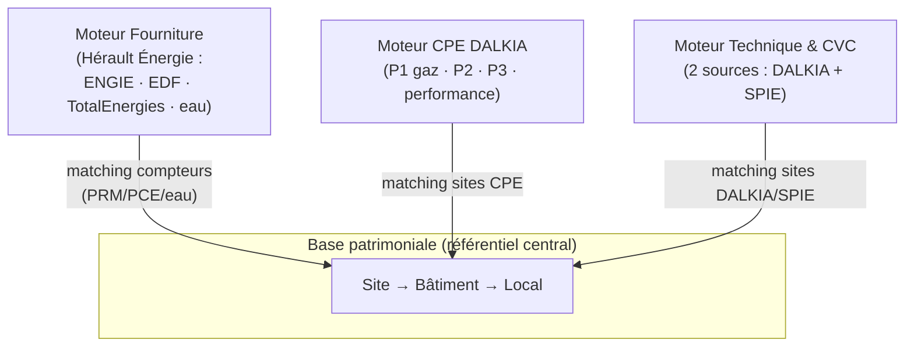

# 10 — Audit des moteurs et de l'expérience utilisateur

> Audit transversal de l'interface au **2026-06-15**.
> Actualise et prolonge [[08-Inventaire-fonctionnalites-developpees-2026-06-02]] (inventaire du code) et
> [[09-Vision-produit-et-navigation-UX]] (navigation cible), avec une nouvelle grille de lecture par **moteurs**
> proposée par l'utilisateur.
> Objectif : comprendre l'usage de tout ce qui a été développé, le documenter, et revoir l'expérience
> utilisateur pour une plateforme au service du **management de l'énergie, de la maintenance et du patrimoine**.

## 1. Pourquoi cet audit

Le produit a grandi par sujets spécifiques (ENEDIS, BPU, TURPE, factures ENGIE, CPE DALKIA finances,
référentiel acte d'engagement, inventaire CVC terrain, fluides frigorigènes, GRDF gaz, factures
fournisseurs multi-fluides…). Chaque brique est utile, mais l'interface les expose encore comme une
**collection de modules techniques** plutôt que comme un parcours métier cohérent. Avec du recul, plusieurs
sujets se regroupent naturellement et doivent partager une même expérience.

L'utilisateur distingue désormais le produit en **moteurs** :

1. moteur **CPE DALKIA** (marché de performance énergétique) ;
2. moteur **marché de fourniture d'énergie Hérault Énergie** (ENGIE, EDF, TotalEnergies ; eau pas encore) ;
3. moteur **inventaire technique & CVC**, alimenté par **deux titulaires de marché** : DALKIA *et* SPIE ;
4. moteur de **base patrimoniale** (référentiel central) ;
5. **matching des sites** DALKIA / SPIE → base patrimoniale ;
6. **matching des compteurs** énergie → base patrimoniale.

Cet audit adopte cette grille comme colonne vertébrale.

## 2. La plateforme en une phrase

> Une plateforme mono-utilisateur (responsable **suivi maintenance & énergie** d'une ville) qui, **faute de
> base patrimoniale municipale existante**, construit son propre **référentiel patrimonial** et y rattache
> le suivi des **consommations**, le **contrôle des factures** des marchés de fourniture et de maintenance,
> et l'**inventaire technique**.

Trois finalités, un socle commun :

| Finalité | Ce que l'utilisateur veut faire | Moteurs concernés |
|---|---|---|
| **Énergie** | suivre les consommations, contrôler/transmettre les factures, optimiser puissances et prix | Fourniture Hérault, base patrimoniale, matching compteurs |
| **Maintenance** | piloter les marchés de maintenance (P1/P2/P3 CPE, CVC), suivre l'état technique | CPE DALKIA, Technique/CVC, base patrimoniale, matching sites |
| **Patrimoine** | connaître et fiabiliser le parc (sites, bâtiments, locaux) | Base patrimoniale (socle de tout le reste) |

## 3. Le modèle en moteurs — la base patrimoniale est la colonne vertébrale



**Lecture clé :** les trois moteurs métier ne valent que reliés au socle patrimonial. Le **tissu connectif**,
ce sont les **moteurs de matching** (sites et compteurs). Or aujourd'hui ce tissu est **le maillon le plus
faible** : le matching compteurs est manuel et sans console de réconciliation, le matching des sites CPE
n'existe pas encore, et seul le matching CVC↔bâtiment est outillé. C'est la cause profonde de la
fragmentation ressentie : chaque moteur garde sa propre liste de sites/compteurs en parallèle.

## 4. Inventaire actualisé par moteur (2026-06-15)

> Compléments depuis l'inventaire du 2026-06-02 (qui comptait 201 routes / 21 pages / 50 modèles).
> Nouveautés majeures intégrées depuis : **GRDF gaz**, **factures fournisseurs multi-fluides** (refonte
> 2026-06-15), **EDF éclairage public CSV**, **CVC fluides frigorigènes (cockpit F-Gaz/ESP)**, **2ᵉ source
> CVC SPIE**, page **Acquisition & données ENEDIS**, **rapport technique CVC**.

Frontend : **25 pages** React (vs 21). Groupes de routes backend : `auth`, `billing`, `bpu`, `buildings`,
`cities`, `cvc`, `enedis_async`, `enedis_sync`, `engie`, `grdf`, `energie`, `equipment`, `cpe`,
`cpe_dalkia`, `pronostics`, `health`.

### 4.1 Moteur — Base patrimoniale (socle)

| Brique | Écran / code | État |
|---|---|---|
| Cascade `Site → Bâtiment → Local` | `/buildings/list` (« Mon patrimoine — vue cascade »), `services/buildings.py` | Cœur — **point d'entrée patrimoine retenu** |
| Carte du patrimoine | `/buildings` (`BuildingsLandingPage`) | Cœur (vue secondaire) |
| Fiche bâtiment | `/buildings/:id`, sources DGFiP/IGN/OSM, locaux, compteurs | Cœur — **point de convergence visé** |
| Import hiérarchique | `/buildings/create-edit`, `building_naming.py` | Cœur |
| Compteurs manuels multi-fluides | `BuildingMeterLink` (PRM/PCE/eau) sur la fiche | **Utile à consolider** — pas de console de rapprochement |

### 4.2 Moteur — Marché de fourniture Hérault Énergie

Fournitures dont la **Ville est titulaire**, hors CPE. Distributeurs = ENEDIS (élec) / GRDF (gaz) =
références de contrôle, pas payeurs (`services/supplier_registry.py`).

| Brique | Écran / code | État |
|---|---|---|
| Portefeuille & fiche PRM | `/energie`, `/energie/:prmId`, `energie.py` | Cœur |
| Acquisition ENEDIS (sync + async FTP/AES) | `/energie/donnees`, `enedis_sync.py`, `enedis_async.py` | Cœur (async bloqué côté canal ENEDIS) |
| DJU, audit couverture | `dju_sync.py`, `/api/energie/data-audit` | Cœur |
| Préconisations puissance | `/energie/preconisations`, `power_recommendations.py` | Cœur |
| Prix contractuels (BPU) + TURPE | `/energie/bpu`, tables `bpu_*`, `turpe.py` | Cœur |
| Configuration tarifaire | `/energie/facturation`, `BillingConfig` | Recouvrement à arbitrer (vs `bpu_*`) |
| **Contrôle factures fournisseurs** (élec ENGIE/EDF ; gaz/eau à intégrer) | `/energie/factures` (refondu 2026-06-15 : 4 étapes Données→Contrôle→Rapport→Liaison finance), `invoice_analysis.py`, `engie_xlsx_import.py`, `edf_csv_import.py` | Cœur |
| Liaison finance fournisseurs (matrice comptable + export) | `energie_accounting.py`, `EnergieAccountingMatrix` | Cœur |
| **GRDF gaz** (distributeur) | `/energie/gaz` (« Suivi temporel des consommations »), `grdf_*`, `gas_analytics.py` | En cours (scaffolding API ADICT) |
| Eau (SUEZ) | — | **Non développé** |
| Proxy API ENGIE | `engie_client.py`, `/api/engie/*` | **Disponible non câblé** (403 abonnement) |

### 4.3 Moteur — CPE DALKIA (marché de performance énergétique)

Le plus gros marché de maintenance. Modalités de paiement propres (acomptes P1, révisions, cibles NB).

| Brique | Écran / code | État |
|---|---|---|
| Cockpit performance & consommations multi-fluides | `/cpe` (Cockpit, Performance), `cpe.py`, `CpeConsoReleve` | Cœur (sites `cpe_sites` vides en prod → volet intéressement vide) |
| Référentiel finance (imports, sites, matrice, références, indices, factures, P3 devis, contrôles) | `/cpe` › Référentiel finance, `cpe_accounting.py`, `cpe_finance_preview.py` | Cœur (aligné sur la trame 2026-06-15) |
| Contrôle factures DALKIA (file priorisée + recalcul) | `/cpe` › Contrôle factures, `CpeFinanceControl` | Cœur |
| Référentiel acte d'engagement (Lot 1/2, versionné) | `/cpe/dalkia-import`, `cpe_dalkia_import.py`, tables `cpe_dalkia_ref_*` | Cœur (outil expert) |
| Diff entre versions d'actes | `cpe_dalkia_diff.py` | Cœur |
| Travaux P3 / devis / atterrissage | `cpe_p3_devis.py`, `cpe_atterrissage.py`, `cpe_market_tracking.py` | En cours |
| Contrôles P1/P2/P3 vs DPGF/OS3 | `_control_*` dans `cpe_accounting.py` | Cœur |

### 4.4 Moteur — Inventaire technique & CVC (2 sources : DALKIA + SPIE)

**Particularité centrale** : l'inventaire CVC provient de **deux titulaires de marché de maintenance**,
DALKIA et SPIE, aux formats différents → un champ `provider` (DALKIA/SPIE) et deux sections/parseurs.

| Brique | Écran / code | État |
|---|---|---|
| Référentiel SYPEMI + assignations | `/buildings/technique`, `equipment.py`, `EquipmentReference`, `BuildingEquipment` | Cœur |
| Inventaire terrain CVC (DALKIA + SPIE) | `/buildings/cvc-import`, `cvc.py`, `CvcInventoryItem` (`provider`) | Cœur |
| Matching site CVC → bâtiment | `/buildings/cvc-import/batiments` (`CvcSiteMappingPage`) | Cœur — **brique de matching la plus aboutie** |
| Cockpit fluides frigorigènes (F-Gaz / ESP) | `/buildings/cvc-fluides` (« Centrale de pilotage F-Gaz/ESP »), `CvcRefrigerantItem` | Cœur (récent) |
| Rapport technique CVC | `/buildings/cvc-rapport-technique` | Cœur (récent) |
| Durées de vie / vétusté | `equipment_references`, durées mini/réf/maxi | Cœur |

### 4.5 Moteurs — Matching (tissu connectif, maillon faible)

| Matching | Outil actuel | État | Manque |
|---|---|---|---|
| **Sites CVC (DALKIA/SPIE) → bâtiment** | `/buildings/cvc-import/batiments` | **Outillé** | Le seul vrai écran de rapprochement |
| **Sites CPE DALKIA → patrimoine** | — (`CpeSite` / `CpeDalkiaRefSite` non reliés à `Site`) | **Manquant** | Console `PO2-PAT-003` ; codes `VDS-PSC` désalignés bloqués en silence |
| **Compteurs énergie (PRM/PCE/eau) → bâtiment** | `BuildingMeterLink` manuel sur la fiche | **Partiel** | File « compteurs sans bâtiment », rapprochement assisté |

### 4.6 Hors plateforme — à isoler

Un module **Pronostics** (CDM 2026 football : `pronostics.py`, `football_data.py`, `/api/pronostics`,
migrations `0037/0039`) cohabite dans le dépôt. Sans lien avec énergie/maintenance/patrimoine.
**Recommandation :** le sortir de la navigation produit (déjà absent de la sidebar) et, à terme, du périmètre
de cette plateforme pour ne pas brouiller le récit produit.

## 5. Audit écran par écran

| Écran | Usage réel | Problème UX | Direction |
|---|---|---|---|
| Sidebar `App.tsx` | navigation | déjà sectionnée (Patrimoine/Énergie/Marchés/Technique/Admin) mais reste une **liste plate de 18 liens** ; pas de notion de moteur ni de page active | sidebar = 6 domaines, sous-nav contextuelle par moteur |
| `/` Tableau de bord | accueil | peu de valeur métier ; pas de files « à traiter » | KPI transverses + **une file par moteur** |
| `/buildings/list` Patrimoine | **entrée patrimoine** | riche mais dense | en faire le hub : depuis un bâtiment, accéder à énergie/CPE/technique |
| `/buildings/:id` Fiche | consultation/édition | longue page verticale | **point de convergence** en onglets (compteurs, conso, factures, technique, contrats) |
| `/energie` + `/energie/donnees` | suivi + acquisition | 2 pages proches (vue d'ensemble vs ops données) | garder, clarifier : *suivi* vs *acquisition* |
| `/energie/factures` | contrôle factures fournisseurs | **refondu 2026-06-15** (objectif + 4 étapes + multi-fluides) | poursuivre : brancher gaz/eau |
| `/energie/bpu` | prix/TURPE | Timeline + TURPE + Documents + Édition mélangés | garder onglets ; déplacer import/édition avancée vers Administration |
| `/energie/gaz` | conso GRDF | nouveau, isolé | relier au matching PCE et au contrôle factures gaz |
| `/cpe` | moteur CPE | **plusieurs produits en une page** (cockpit, finance×8 sous-sections, performance) | rendre visibles les parcours CPE de niveau 2 ; aligné trame 2026-06-15 |
| `/cpe/dalkia-import` | référentiel expert | outil expert au 1ᵉʳ niveau | → Administration / Référentiel contractuel |
| `/buildings/technique` | inventaire | dense, CVC + SYPEMI + enveloppe | onglets ; séparer source DALKIA / SPIE |
| `/buildings/cvc-import` (+ `/batiments`) | import + matching | matching séparé : bonne pratique | **généraliser ce pattern de rapprochement** aux compteurs et sites CPE |
| `/buildings/cvc-fluides`, `/buildings/cvc-rapport-technique` | F-Gaz/ESP, rapport | récents, utiles | regrouper sous Technique |

## 6. Diagnostic transverse

1. **Le socle est sain, le tissu connectif est faible.** La base patrimoniale, les moteurs énergie/CPE/CVC
   sont matures *isolément*. Ce qui manque, c'est la **réconciliation systématique vers le patrimoine**
   (sites CPE non reliés, compteurs liés à la main, 3 représentations de « site » qui cohabitent —
   `Site`, `CpeSite`, `CpeDalkiaRefSite`, cf. [[08...]] §4.3).
2. **L'interface raconte le code, pas le métier.** Les libellés et regroupements suivent les sources
   (BPU, SYPEMI, DALKIA-import) au lieu des moteurs et des gestes utilisateur.
3. **Des capacités du moteur restent « sous le capot ».** Plusieurs opérations ne se font qu'en
   script/SQL/SSH (seed `cpe_sites`, recalcul global, lecture des contrôles, réconciliation de codes) —
   cf. [[09...]] §13. *Toute opération que l'assistant doit faire en SQL/SSH est un trou d'UX.*
4. **Pas de files de travail visibles.** L'utilisateur ne voit pas d'un coup d'œil « ce qu'il y a à traiter »
   par moteur (factures à contrôler, compteurs sans bâtiment, sites non reliés, imports en erreur).
5. **Du bruit dans le périmètre** (module Pronostics) qui dilue le récit produit.

## 7. Expérience utilisateur cible

### 7.1 Profil & principe directeur

Utilisateur unique = **responsable suivi maintenance & énergie**, admin de fait. Principe : organiser
l'interface par **moteur**, chaque moteur offrant *Résumé → Analyse → Détail technique* et **sa file
à traiter**, le tout convergent vers la **fiche patrimoine**.

### 7.2 Navigation cible (actualisée par moteur)

Prolonge la sidebar retenue dans [[09...]] §12, enrichie des modules récents :

```text
Tableau de bord            (files « à traiter » par moteur + KPI transverses)

Patrimoine                 (socle)
  Sites et bâtiments       (= /buildings/list, entrée)
  Carte
  Rapprochements           (compteurs ↔ bâtiment, sites ↔ patrimoine)   ← matching unifié

Énergie                    (moteur fourniture Hérault)
  Vue d'ensemble           (= /energie)
  Acquisition & données    (= /energie/donnees : ENEDIS / GRDF)
  Factures fournisseurs    (= /energie/factures : élec · gaz · eau)
  Préconisations
  Prix et TURPE (BPU)
  Gaz (GRDF)               (conso PCE)

Marchés et contrats        (entrée générique : d'autres marchés viendront)
  CPE DALKIA
    Tableau de bord CPE
    Contrôle factures
    Suivi financier
    Formules et indices
    Travaux P3 / APE / devis
    Référentiel contractuel
  (futurs marchés de maintenance : SPIE, etc.)

Technique                  (moteur inventaire & CVC, 2 sources DALKIA+SPIE)
  Inventaire & CVC
  Fluides frigorigènes (F-Gaz/ESP)
  Rapport technique
  (source : filtre DALKIA / SPIE)

Administration
  Imports (patrimoine, CVC DALKIA/SPIE, ENGIE/EDF, acte DALKIA)
  Référentiels (BPU, configuration tarifaire, matrices comptables)
  Historique & diagnostics (traitements, ENEDIS async, santé prod)

Compte · Déconnexion
```

Notes d'évolution vs §12 de [[09...]] :
- **Rapprochements** devient un **vrai moteur de matching unifié** (compteurs + sites), généralisant le
  pattern réussi de `/buildings/cvc-import/batiments`.
- **Technique** assume explicitement les **2 sources DALKIA/SPIE** (filtre/onglet de provenance).
- **SPIE** est un **marché de maintenance à part entière** (acté §10) : entrée sous *Marchés et contrats*
  (symétrique du CPE DALKIA), en plus de sa dimension *source d'inventaire* qui reste filtrable dans Technique.

### 7.3 La fiche patrimoine, point de convergence

Une fois le matching fiabilisé, la fiche `Bâtiment` (et `Site`) agrège tout : compteurs (PRM/PCE/eau) →
consommations → factures fournisseurs **et** DALKIA → équipements/CVC → contrats. C'est l'écran qui
transforme une collection de modules en une plateforme. Onglets cibles : *Résumé · Identité & sources ·
Locaux · Compteurs · Consommations · Factures · Équipements · Contrats · Conformité · Documents*.

### 7.4 Règles UX transverses

- **Une file « à traiter » par moteur**, remontée sur le tableau de bord (décision actée [[09...]] §12) :
  factures fournisseurs à contrôler · factures DALKIA bloquées/en écart · compteurs sans bâtiment ·
  sites CPE/DALKIA/SPIE non reliés · imports en erreur · justificatifs manquants · travaux P3 en retard.
- **Trois niveaux de lecture** par écran dense (Résumé / Analyse / Détail technique).
- **Vocabulaire métier** stable (cf. [[09...]] §8.4), sigles expliqués.
- **Imports = contextuels ou Administration** : action quotidienne dans le parcours, paramétrage rare en Admin.

## 8. Écarts moteur ↔ interface (opérabilité — à combler en priorité)

Repris et actualisés de [[08...]] §8.2 et [[09...]] §13 :

| Prio | À rendre faisable dans l'UI | Moteur | Écran cible |
|---|---|---|---|
| P0 | Initialiser/MAJ `cpe_sites` depuis l'import DALKIA | CPE | Référentiel contractuel |
| P0 | Recalcul des contrôles visible + file lisible (poste/site/attendu vs facturé/motif) | CPE | Contrôle factures |
| P1 | **Console de rapprochement unifiée** (compteurs ↔ bâtiment, sites ↔ patrimoine) | Matching | Patrimoine › Rapprochements |
| P1 | Re-consulter les données DALKIA persistées (P2/P3, cibles, P1, APE, RECAP, BPU) | CPE | Référentiel contractuel |
| P1 | Brancher gaz (TotalEnergies/GRDF) puis eau (SUEZ) sur le pipeline factures | Fourniture | Factures fournisseurs |
| P2 | Bandeau « version déployée + santé API » | transverse | Administration |
| P2 | Sortir le module Pronostics du périmètre produit | — | — |

## 9. Plan de refonte par phases

**Phase 1 — Clarifier sans casser (UI/nav).**
Sidebar à 6 domaines + sous-nav par moteur ; libellés métier ; pages actives ; déplacer les imports experts
vers Administration (routes inchangées). *Risque faible, fort gain de lisibilité.*

**Phase 2 — Construire le tissu connectif (matching).**
Console **Rapprochements** unifiée : généraliser le pattern CVC↔bâtiment aux **compteurs** et aux **sites CPE**.
Files « à traiter » par moteur sur le tableau de bord. *C'est le chantier le plus structurant.*

**Phase 3 — Fiche patrimoine convergente.**
Onglets sur la fiche Bâtiment/Site agrégeant énergie, factures, technique, contrats une fois le matching en place.

**Phase 4 — Compléter les moteurs.**
Gaz (Total/GRDF) puis eau (SUEZ) dans le contrôle factures ; travaux P3/APE ; consolidation `bpu_*` /
`BillingBpuLine` et `CvcInventoryItem` / `BuildingEquipment`.

## 10. À arbitrer avec l'utilisateur

1. **SPIE** : à traiter comme *source d'inventaire technique* uniquement, ou aussi comme *marché de
   maintenance* à part entière sous « Marchés et contrats » (symétrique du CPE DALKIA) ?
2. **Rapprochements** : une seule console unifiée (compteurs + sites + CVC), ou rester sur des écrans de
   matching séparés par moteur ?
3. **Ordre des phases** : prioriser d'abord la refonte navigation (Phase 1, visible vite) ou le moteur de
   matching (Phase 2, structurant mais plus long) ?
4. **Eau** : périmètre attendu (fournisseur, format de facture, distributeur) pour cadrer l'intégration ?
5. **Pronostics** : on le sort officiellement du périmètre produit (et de ce dépôt à terme) ?

### Décisions actées (2026-06-15)

1. **SPIE = marché de maintenance à part entière** (pas seulement une source d'inventaire) → entrée sous
   **« Marchés et contrats »**, symétrique du CPE DALKIA. La dimension *inventaire* reste dans Technique
   (filtre source DALKIA/SPIE) ; la dimension *marché* (contrat, prestations, suivi) vit sous Marchés et contrats.
2. **Matching = écrans séparés par moteur** (pas de console unifiée) : un écran de rapprochement par moteur,
   réutilisant le **pattern** de `/buildings/cvc-import/batiments` mais sans tout fusionner.
3. **Ordre : commencer par le moteur de matching** (ex-Phase 2) avant la refonte navigation (ex-Phase 1).
   C'est le maillon faible structurant : on le traite en premier.
4. **Eau : à travailler** (fournisseur / format / distributeur à préciser ultérieurement).
5. **Pronostics** : module **personnel hors plateforme** (jeu Coupe du Monde avec les agents de la
   collectivité). Sans rapport avec énergie/maintenance/patrimoine → ne pas l'intégrer au récit produit ;
   le laisser de côté (pas de travail dessus).

### Plan révisé (ordre acté)

| Étape | Contenu | Statut |
|---|---|---|
| **A — Moteur de matching** (priorité) | écrans de rapprochement séparés : **compteurs↔bâtiment livré** (`/buildings/compteurs`, PRM+PCE) ; restent sites CPE↔patrimoine, sites SPIE↔patrimoine (CVC↔bâtiment existe déjà) | **en cours** |
| B — Navigation par moteur | sidebar 6 domaines + sous-nav ; SPIE ajouté sous Marchés et contrats | après A |
| C — Fiche patrimoine convergente | onglets agrégeant énergie/factures/technique/contrats | après A |
| D — Compléter moteurs | gaz (Total/GRDF), **eau (SUEZ)**, travaux P3/APE | en continu |

> Prochaine action : cadrer l'**écran de matching à construire en premier** (cf. §A) puis l'implémenter
> en réutilisant le pattern `CvcSiteMappingPage`.
