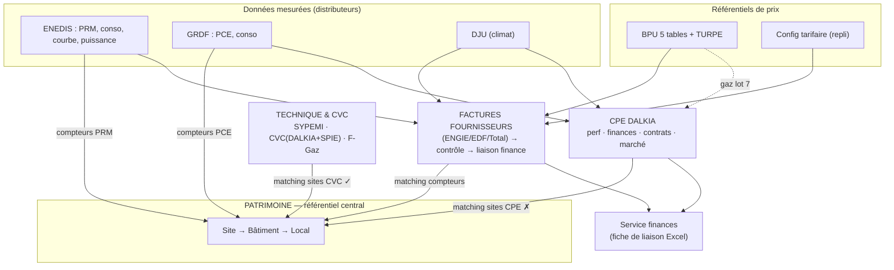

# 11 — Analyse backend approfondie & socle pour la refonte UX/UI

> Date : 2026-06-15. Lecture **partant du backend** : ce que le produit *sait faire* (capacités réelles,
> endpoints, services, modèles) et **comment les fonctionnalités se relient**, pour ensuite **regrouper sous
> des items** et concevoir l'UX/UI. Prolonge [[08-Inventaire-fonctionnalites-developpees-2026-06-02]] (côté
> code) et [[10-Audit-moteurs-et-experience-utilisateur-2026-06-15]] (côté produit), avec ici la **grammaire
> fonctionnelle et le graphe de dépendances**.

## 1. Surface fonctionnelle (poids réel par domaine)

279 endpoints sur 17 routeurs. Le poids dit où est la valeur métier :

| Routeur | Préfixe | Endpoints | Domaine |
|---|---|---:|---|
| `cpe` | `/cpe` | 56 | **CPE DALKIA** (finances, contrôles, sites, conso, indices) |
| `billing` | `/billing` | 38 | **Factures fournisseurs** + matrice comptable + config tarifaire |
| `buildings` | `/buildings` | 31 | **Patrimoine** (sites/bâtiments/locaux, naming, compteurs, matching) |
| `engie` | `/engie` | 24 | Proxy API ENGIE Entreprise (**non câblé** front) |
| `bpu` | `/bpu` | 22 | Prix contractuels (BPU) + TURPE |
| `cpe_dalkia` | `/cpe/dalkia-ref` | 21 | Référentiel acte d'engagement DALKIA (versionné) |
| `cvc` | `/cvc` | 20 | Inventaire technique & CVC |
| `energie` | `/energie` | 13 | Portefeuille PRM, préconisations, audit données |
| `pronostics` | `/pronostics` | 13 | **Hors plateforme** (jeu Coupe du Monde) |
| `enedis_sync` / `enedis_async` | `/energie/sync*` | 11 + 6 | Acquisition ENEDIS |
| `grdf` | `/grdf` | 8 | Distributeur gaz (PCE, conso) |
| `equipment` | `/equipment` | 8 | Référentiel SYPEMI |
| `auth`/`cities`/`health`/`internal` | — | 8 | Socle |

**Lecture** : deux centres de gravité — le **CPE DALKIA** (56) et la **chaîne factures fournisseurs**
(billing 38 + bpu 22 + engie 24). Le **patrimoine** (31) est le socle. Le reste = acquisition de données
(ENEDIS, GRDF) et technique (CVC, equipment).

## 2. Cartographie fonctionnelle par capacité

Pour chaque bloc : *ce que ça sait faire* · *modèles/tables* · *services* · *surface API*.

### 2.1 Socle & sécurité
- Auth JWT, profil, mot de passe ; multi-tenant par `city_id` (filtre transverse) ; healthcheck.
- Modèles : `User`, `City`. Services : `auth`, `cities`. API : `/auth`, `/cities`, `/health`.

### 2.2 Patrimoine — le référentiel central
- Cascade `Site → Building → Local` ; import hiérarchique ; rapprochement DGFiP/IGN/OSM (création &
  correction géo) ; trace IGN ; **compteurs multi-fluides** (`BuildingMeterLink`) ; **matching compteurs**
  (nouveau, `/buildings/meters/matching`).
- Modèles : `Site`, `Building`, `Local`, `BuildingMeterLink`. Services : `buildings`, `building_naming`,
  `meter_matching`. API : `/buildings` (31).

### 2.3 Énergie élec — acquisition (données mesurées)
- Synchro ENEDIS **synchrone** (conso, puissance max, courbe de charge) et **asynchrone** FTP/AES ;
  couplage **DJU** ; audit de couverture des données ; store courbe de charge (lecture par PRM, garde-fou OOM).
- Modèles : `EnedisAsyncJob` (+ snapshots CSV ENEDIS hors DB). Services : `enedis_sync`,
  `enedis_customer_sync`, `enedis_async`, `enedis_common`, `dju_sync`, `dju_profiles`, `load_curve_store`.
  API : `/energie/sync*` (17).

### 2.4 Énergie élec — exploitation
- Portefeuille & fiche PRM (contrat, adresse, segment, puissance) ; **calibrage** puissance souscrite vs
  pic 3 ans ; **préconisations** chiffrées ; coûts réels puissance ; saisonnalité DJU.
- Services : `energie`, `power_recommendations`, `power_real_costs`. API : `/energie` (13).

### 2.5 Prix contractuels (BPU) & TURPE
- Historique BPU normalisé **5 tables** (`bpu_documents/segments/time_periods/price_components/fixed_charges`),
  multi-années EDF/ENGIE/gaz lot 7 ; timeline ; **TURPE** (référentiel CRE) ; **config courante**
  (`BillingConfig`/`BillingBpuLine`) = repli de contrôle. ⚠️ **Deux sources de prix** (historique `bpu_*` vs
  config courante) volontairement coexistantes.
- Services : `bpu`, `turpe`, `billing`, `billing_bpu_sync`, `invoice_bpu`. API : `/bpu` (22), part de `/billing`.

### 2.6 Factures fournisseurs (marché Hérault Énergie)
- **Normalisation** facture indépendante de la source (`EnergyInvoice/Site/Period/Line/MeterRead/Check`) ;
  **parsers** ENGIE PDF, ENGIE XLSX (1 an d'historique), EDF CSV (éclairage public) ; **import par lots**
  persistants ; **contrôle** prix vs BPU (historique puis repli courant) + TURPE + quantités vs ENEDIS +
  cohérence périodes ; **décision** (valider/contester) ; **registre fournisseurs** (`supplier_registry` :
  qui facture quoi) ; **matrice comptable** + **fiche de liaison Excel** vers finance (`energie_accounting`).
- Modèles : `EnergyInvoice*`, `EnergyAccountingSiteMapping/NatureRule`, `EnergyInvoiceBatch*`,
  `BillingConfig/BpuLine`. Services : `invoice_normalization`, `invoice_analysis`, `invoice_bpu`,
  `engie_xlsx_import`, `edf_csv_import`, `invoices`, `energie_accounting`, `supplier_registry`,
  `engie_client`. API : `/billing` (38), `/engie` (24, proxy non câblé).

### 2.7 Gaz GRDF (distributeur)
- **PCE** + consommations ; API GRDF ADICT (auth, GDA droits d'accès, contractuel, conso) ; analytics gaz ;
  `GasPce.building_id` (rattachement direct, synchronisé par le matching compteurs).
- Modèles : `GasPce`, `GasConsumption`. Services : `grdf_auth/client/gda/contractuel/conso`, `gas_analytics`.
  API : `/grdf` (8).

### 2.8 CPE DALKIA (marché de performance énergétique — le plus gros)
Quatre sous-systèmes imbriqués :
1. **Performance & conso** : sites CPE, relevés multi-fluides (`CpeConsoReleve` : GAZ/ELEC/ECS/EAU/CHALEUR),
   cibles NB/N'B, bilan d'intéressement, **atterrissage trimestriel** (projection DJU, `cpe_atterrissage`).
2. **Finances & factures** : factures DALKIA (`CpeFinanceInvoice/Line`), **matrice de codification**
   (site→nature comptable), **contrôles** (P1 gaz OS3, P2/P3 base DPGF, acompte P1, P2.4/P3.4 objectifs),
   file priorisée, **fiche de liaison Excel**, horodatage transmission finances.
3. **Référentiel contractuel versionné** : import des **actes d'engagement** Lot 1/2 (`cpe_dalkia_ref_*` :
   P2P3, cibles, P1 gaz/tarifs, RECAP, APE, BPU travaux Annexe 7), **moteur de diff** entre versions
   (`cpe_dalkia_diff`), sync de la référence P1 depuis le RECAP.
4. **Pilotage marché** : suivi **prévu (DPGF) vs reçu** par poste (`cpe_market_tracking`), **devis P3/P6**
   et atterrissage P3 (`cpe_p3_devis`), formules/indices de révision + **preuves PDF**.
- Services : `cpe`, `cpe_import`, `cpe_accounting`, `cpe_finance_preview`, `cpe_dalkia_import`,
  `cpe_dalkia_db`, `cpe_dalkia_diff`, `cpe_dpgf_p1`, `cpe_atterrissage`, `cpe_market_tracking`,
  `cpe_p3_devis`. API : `/cpe` (56) + `/cpe/dalkia-ref` (21).

### 2.9 Technique & CVC (2 sources : DALKIA + SPIE)
- Référentiel **SYPEMI** + assignations ; **inventaire terrain CVC** (`provider` DALKIA/SPIE) ; matching
  site CVC→bâtiment ; **cockpit fluides frigorigènes** (F-Gaz/ESP, seuils CO₂eq, plan d'action) ; **rapport
  technique** ; durées de vie / vétusté.
- Modèles : `EquipmentReference`, `BuildingEquipment`, `CvcInventoryItem`, `CvcRefrigerantItem`,
  `CvcSourceBuildingMapping`. Services : `equipment`, `cvc`. API : `/cvc` (20), `/equipment` (8).

### 2.10 Hors périmètre plateforme
- Proxy **ENGIE** (`/engie`, 24) : profils/sites/contrats/conso/factures — **aucun appel front** (bloqué 403
  abonnement). À garder en veille ou archiver.
- **Pronostics** (`/pronostics`, 13) : jeu Coupe du Monde, sans lien produit → à sortir.

## 3. Le graphe de relations (cœur de l'analyse)

Ce que partagent/relient les fonctionnalités — **c'est ce qui doit guider l'UX** :

**Points de jointure partagés (à exploiter en UX, pas à dupliquer) :**
- **DJU** alimente à la fois préconisations élec, atterrissage CPE et analytics gaz → un seul référentiel climat.
- **BPU** alimente le contrôle factures **et** la config tarifaire → deux vues d'un même prix.
- **Compteurs** (PRM/PCE) sont le pont données↔patrimoine ; **sites** sont le pont marchés↔patrimoine.
- **Fiche de liaison finance** est le **livrable commun** des deux marchés (fournisseurs ET CPE).

**Frictions structurelles (dette de liaison) :**
- **3 représentations de « site »** : `Site` (patrimoine), `CpeSite` (opérationnel), `CpeDalkiaRefSite`
  (contractuel) — non reliées.
- **3 surfaces de lien compteur** : `BuildingMeterLink`, `GasPce.building_id`, `EnergyInvoiceSite.prm` — le
  matching compteurs commence à unifier.
- **2 référentiels de prix** (`bpu_*` vs config) et **2 inventaires techniques** (`BuildingEquipment` vs
  `CvcInventoryItem`).
- **Matching sites CPE absent** → le plus gros marché n'est pas relié au patrimoine.

## 4. Regroupement proposé sous items (ta grille d'action)

Chaque capacité backend → un item d'interface. C'est la table à valider/annoter pour « relier les
fonctionnalités sous des items ».

| Item de navigation | Capacités backend regroupées | Statut |
|---|---|---|
| **Tableau de bord** | KPI transverses + files « à traiter » de chaque domaine | à construire |
| **Patrimoine › Sites & bâtiments** | cascade, fiche, import hiérarchique, naming DGFiP/IGN/OSM | existant |
| **Patrimoine › Rapprochements** | matching compteurs (✓), matching sites CPE (à créer) | partiel |
| **Énergie › Vue d'ensemble** | portefeuille PRM, audit couverture, saisonnalité | existant |
| **Énergie › Acquisition** | ENEDIS sync/async, GRDF, DJU | existant |
| **Énergie › Factures fournisseurs** | normalisation, parsers, contrôle BPU/TURPE/ENEDIS, rapport, liaison finance | existant (refondu) |
| **Énergie › Préconisations** | calibrage, coûts réels, chiffrage | existant |
| **Énergie › Prix & TURPE** | BPU 5 tables, timeline, TURPE | existant |
| **Énergie › Gaz (GRDF)** | PCE, conso, analytics gaz | en cours |
| **Marchés & contrats › CPE DALKIA** | perf/atterrissage, finances/contrôles, référentiel contractuel+diff, marché prévu/reçu, P3 devis, indices | existant (dense) |
| **Marchés & contrats › SPIE** | marché maintenance (à construire) + ses inventaires | à créer |
| **Technique › Inventaire & CVC** | SYPEMI, CVC (filtre DALKIA/SPIE), durées de vie | existant |
| **Technique › Fluides F-Gaz/ESP** | cockpit fluides, plan d'action | existant |
| **Administration** | imports experts (acte DALKIA, BPU, codification), config tarifaire, diagnostics, ENEDIS async | à regrouper |

## 5. Direction UX/UI proposée

Principes pour une interface « impressionnante » mais **au service de la lecture métier** :

1. **Tableau de bord = cockpit à files de travail.** Pas une page d'accueil décorative : les objets *à
   traiter* de chaque moteur (factures à contrôler, compteurs/sites non reliés, factures DALKIA bloquées,
   atterrissage trimestriel, fluides en échéance) remontent en cartes actionnables, avec un chiffre, une
   tendance et un bouton « traiter ».
2. **3 niveaux de lecture systématiques** (Résumé → Analyse → Détail technique) : l'utilisateur comprend une
   anomalie sans traverser le JSON ou le SQL.
3. **La fiche patrimoine comme point de convergence** : depuis un bâtiment, voir compteurs → conso → factures
   (fournisseurs *et* DALKIA) → équipements → contrats. C'est le matching qui débloque cette vue.
4. **Vocabulaire métier** (sigles expliqués), libellés stables, pas de noms de tables.
5. **Identité visuelle** : thème sombre déjà en place ; renforcer par une grille de cartes cohérente, des
   états (badges) lisibles, des graphes sobres (déjà : recharts), une densité maîtrisée (filtres repliés).

> Maquette visuelle de la cible (tableau de bord + navigation par moteur) présentée en complément de ce
> document dans le fil de discussion.

## 6. À arbitrer / prochaines décisions

1. **Items §4** : valides-tu ce regroupement ? items à fusionner/renommer/ajouter ?
2. **Tableau de bord** : quelles 5–6 files de travail prioritaires veux-tu voir en premier ?
3. **Dette de liaison** (3 sites / 3 compteurs / 2 prix / 2 inventaires) : on planifie sa résorption
   maintenant, ou on la documente et on avance sur l'UX d'abord ?
4. **Profondeur** : veux-tu que je descende au niveau **endpoint par endpoint** pour un ou deux domaines
   précis (ex. CPE, factures), ou ce niveau « capacité » suffit comme socle ?
