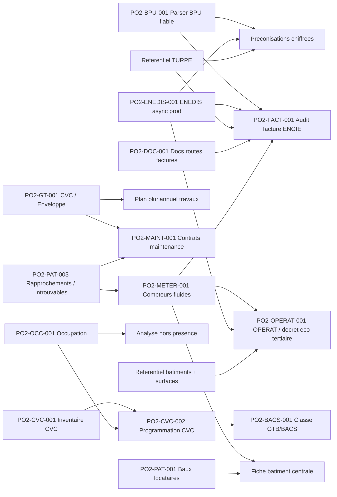

# Backlog operationnel Po2

> Role : transformer la roadmap en liste de taches pilotables.
> Regle : la roadmap decrit la vision produit ; ce fichier decide quoi faire ensuite, dans quel ordre, et pourquoi.

## Contrainte de travail

Le poste utilisateur est un ordinateur entreprise : aucune installation locale de bibliotheques Python, Node, npm, outils systeme ou dependances projet ne doit etre supposee.

Consequences :

- ne pas demander a l'utilisateur d'installer `pytest`, `npm`, `pip`, `node`, `pdfplumber`, Docker ou autres dependances ;
- les validations doivent passer par GitHub Actions, Codespaces si disponible, VPS, conteneurs existants, ou l'environnement Codex quand il fournit deja les outils ;
- toute nouvelle dependance doit etre ajoutee au repo (`requirements.txt`, `package.json`, Dockerfile, CI), jamais seulement installee sur le poste utilisateur ;
- Obsidian sert de cockpit projet, pas d'environnement d'execution.

## Cap direction 2026

La priorite n'est plus d'ajouter des modules isoles. Elle est de produire cinq preuves lisibles par la direction :

1. factures conformes aux contrats signes et decision de paiement tracable ;
2. budget initial/courant, realise, engage et atterrissage selon la matrice comptable ;
3. etat CVC, criticite et plan pluriannuel de travaux chiffre ;
4. couverture des marches de maintenance et liste des sites/equipements non entretenus ;
5. consommations ENEDIS/GRDF, DJU et atterrissage annuel physique puis financier.

La refonte frontend est un chantier transversal P0. Voir [[20-Cap-direction-2026-factures-budget-CVC-maintenance]].

La seconde passe d'audit confirme ces axes et rend explicites les fondations/angles morts : [[23-Seconde-passe-audit-fonctionnel-et-angles-morts]].

## Mode de developpement

Les capacites metier et l'experience utilisateur avancent sur deux pistes synchronisees. Toute nouvelle capacite doit etre rattachee avant codage a un profil, une situation, une decision, une preuve et un ecran cible. Une tranche n'est terminee que lorsque moteur et parcours sont valides ensemble sur un cas reel. Voir [[22-Developpement-deux-pistes-et-profils-utilisateurs]].

Le registre quotidien de couverture des fonctionnalites et du frontend est [[24-Cockpit-canonique-reconstruction-produit-frontend]]. Les anciens inventaires restent des preuves techniques.

## Vue priorisee

| ID | Chantier | Statut | Priorite | Depend de | Debloque | Prochaine action |
|---|---|---|---|---|---|---|
| PO2-DIR-001 | Dossier de controle contractuel multi-marches | En cours | P0 | ENGIE, EDF, TotalEnergies, DALKIA, futurs contrats SPIE, matrice comptable | Decision payer/refuser defendable et export finance unique | Figer le dossier commun (contrat/version, perimetre, controles chiffres, sources, decision, export), puis valider un echantillon reel ENGIE, EDF, TotalEnergies et DALKIA. |
| PO2-CORE-001 | Qualite, provenance, versions et audit transversaux | Todo | P0 | Patrimoine, imports et profils | KPI et decisions defendables | Unifier source/fraicheur/couverture/confiance, version/date d'effet et journal des corrections/decisions dans les contrats d'ecran des tranches P0. |
| PO2-FIN-002 | Intégration engagements, mandats et paiements CIRIL | Futur | P2 | Accès ou export CIRIL structuré non disponible | Éventuelle réconciliation comptable future | Hors V1 : la plateforme s’arrête à la transmission au service finances ; CIRIL est mis à jour manuellement par la comptable. Réouvrir seulement si une interface ou un export fiable devient disponible. |
| PO2-MAINT-003 | Execution de la maintenance et preuves de service | Futur | P1 | PO2-MAINT-001/002, equipements, contrats | Savoir si un site est effectivement entretenu | Cadrer plan preventif, periodicites, interventions attendues/realisees, comptes rendus, reserves, SLA, levees et penalites apres la matrice de couverture. |
| PO2-FIN-001 | Budget initial, factures et atterrissage par matrice comptable | En cours | P0 | Budget par numéro d’opération, factures, échéanciers et projections | Pilotage direction et anticipation des dépassements | Contrat d’écran 35 livré. Schéma backend versionné posé 2026-06-25 (migration `0064`, tables `accounting_matrix_contracts/versions/rules` + `invoice_accounting_snapshots`, router `/api/accounting-matrices/*`, ADR [[Decisions/010-matrices-comptables-versionnees]]) : lecture/création/version/activation, invariant « pas d’écrasement d’une version active ». Seed depuis `energy_accounting_*`/`cpe_accounting_*` (`POST /api/accounting-matrices/seed`, versions `V0` en `draft`, énergie par fournisseur / CPE par contrat). Backend matrices **complet et mergé** dans `main` : import/export XLSX avec diff (PR #27), application + snapshots immuables avec contrôle ventilation et dédoublonnage (PR #28). Restent : brancher les extracteurs réels de lignes facture par source (energy_import/gaz/CPE) sur `apply`, droits par rôle (doc 35 §6), et bascule du frontend `/refonte-v1/factures` vers `/api/accounting-matrices/*`. **Atterrissage vs budget CONTRACTUEL (§5bis, PR #36 non mergée)** : `services/accounting_contract_budget.py` + route `/api/cpe/finances/contract-budget-landing` + onglet front `/refonte-v1/marches` ; budget = prévu DPGF DALKIA (contractuel), réalisé = factures CPE par poste, calcul à la volée. Reste ENGIE (conso ENEDIS)/EDF (cible à définir)/P3.4. Audit : `refonte-v1/cibles-contractuelles-budget-matrice-audit.md`. |
| PO2-ENE-002 | Suivi temporel ENEDIS/GRDF, DJU, atterrissage et calibrage des abonnements | En cours | P0 | Séries distributeurs, DJU fiables, rattachements, paramètres contractuels et prix | Prévision annuelle kWh/euros et recommandation d’abonnement explicables | Contrat d’écran livré dans le document 34 et prototype détaillé disponible. Électricité : courbes ENEDIS 30 min confrontées aux puissances EDF/ENGIE. Gaz : profil GRDF/CAR confronté au contrat TotalEnergies. Eau : méthode prévue selon télérelève et structure tarifaire. Restent moteurs de recommandation, portefeuille unifié et valorisation versionnée. |
| PO2-CVC-003 | Etat CVC et plan pluriannuel de travaux chiffre | En cours | P0 | PO2-CVC-001, arbitrage doubles inventaires, couts/devis/ratios | Programmation 5-10 ans et risques non finances | Unifier la lecture des deux inventaires, rendre la criticite explicable, ajouter cout bas/central/haut + source et construire le PPT par site/famille/annee. |
| PO2-MAINT-002 | Audit de couverture maintenance DALKIA/SPIE | Todo | P0 | PO2-MAINT-001, PO2-PAT-003, perimetres contractuels reels | Reponse fiable a « quels sites ne sont pas entretenus ? » | Reunir les listes DALKIA/SPIE, definir les lots attendus, rattacher contrats -> patrimoine/equipements, puis produire les statuts couvert/prouve, ambigu, non couvert, hors perimetre et chevauchement. |
| PO2-SPIE-001 | Referentiel et controle du marche SPIE P2 | Todo | P0 | Acte/CCAP-CCTP/DPGF-BPU, perimetre, echeancier, factures exemples | Controle SPIE et couverture preventive | Classer les pieces et versions, importer le perimetre, modeliser les prestations P2 puis brancher le dossier commun ; ne pas cloner DALKIA. |
| PO2-UX-002 | Modernisation frontend et decomposition des monolithes | En cours | P0 | Shell produit, parcours P0 | Interface moderne, coherente et maintenable | Labo React V1 (cockpit/factures/fluides/sites mockés sous `/refonte-v1`) repris sur branche `feat/frontend-react-v1` (PR #30). **Premier écran connecté au vrai backend** : `/refonte-v1/matrices` (`MatrixAdminPageV1`) consomme `/api/accounting-matrices/*` (client `lib/api.ts` + hooks React Query). Build CI vert, déployé sur staging. Méthode : valider chaque tranche sur staging avant merge `main`. Prochaine action : revue visuelle → merge #30 ; puis brancher `/refonte-v1/factures` sur l'API matrices et porter les autres pages tranche par tranche. |
| PO2-UX-003 | Profils utilisateurs et contrats d'ecran | En cours | P0 | Cartographie fonctionnelle, parcours P0 | Accueils adaptes sans fragmenter le produit | Contrats d’écran Fluides (34), Factures & décisions (35), Cockpit Direction et Sites 360° (36) livrés. Prochaine étape : valider à l’usage puis préparer la migration React de la première tranche. |
| PO2-UX-004 | Atelier BPMN produit/UX interactif | Fait | P0 | Registre canonique 24 | Co-conception visuelle des workflows | Etat actuel porte a 11 diagrammes, 155 cadres et 171 relations apres audit du code. Couverture actuelle 55/55, fiches specialisees, navigation, duplication, sauvegarde et fusion non destructive. |
| PO2-UX-005 | Modele V1 plateforme operationnelle cible | En cours | P0 | PO2-UX-004, registre canonique, profils utilisateurs | Cible partagee avant reprise du developpement | Décisions du document 30 intégrées : Responsable de service maintenance, CIRIL hors V1, seuil P3, budget par opération, portefeuille Sites 360° et premier lot Facturation/Cockpit/Sites/Fluides. Prochaine action : contrats d’écran. |
| PO2-UX-006 | Arbitrages utilisateur avant refonte V1 | En cours | P0 | PO2-UX-005, profils, donnees et sources metier | Workflows et contrats ecran sans hypotheses implicites | Réponses consolidées à 95/100 dans les documents 30 et 32. Restent R13 revalidation DALKIA P1/P2/P3, R14 pièces SPIE et R27 jeux de recette. |
| PO2-UX-007 | Prototype frontend V1 sans backend | En cours | P0 | PO2-UX-005/006, profils et parcours prioritaires | Évaluer la direction visuelle avant raccordement | Fluides, Factures & décisions, Cockpit Direction et Sites 360° sont détaillés et portés en laboratoire React mocké. Build validé ; prochaine étape : revue visuelle ciblée puis raccordement progressif. |
| PO2-UX-008 | Registre de preparation au raccordement frontend | En cours | P0 | PO2-UX-006/007, contrats, preuves et donnees de recette | Atteindre 100 de préparation mesurable | Les six choix Fluides sont fermés et le contrat d’écran est livré. Plus aucune question générale n’est attendue de Pascal ; restent revalidation DALKIA, corpus SPIE, recette réelle et travaux techniques de raccordement. |
| PO2-FACT-003 | Cycle de vie factures et reimports annuels | Todo | P0 | Imports ENGIE/EDF/Total existants, decisions et lots | Importer une annee complete sans retraiter les factures closes | Harmoniser cle stable, statuts nouvelle/traitee/archivee/reouverte, revisions, preservation des decisions et rapport cree/ignore/mis a jour/erreur. |
| PO2-MKT-003 | Contacts entreprise et reclamations de facturation | Todo | P0 | Referentiel marches/lots, decisions facture | Contacter le bon interlocuteur et tracer la resolution | Gerer contacts principal/escalade dates, generer destinataire/objet/message/preuves, ouvrir la messagerie ou copier le contenu, confirmer envoi et suivre relances. Envoi direct reporte apres validation d usage. |
| PO2-AUDIT-001 | Inventaire complet des fonctionnalites developpees | Fait | P0 | Lecture code + vault | Arbitrages de simplification fiables | Livre 2026-06-02 : `docs/Archives/08-Inventaire-fonctionnalites-developpees-2026-06-02.md` *(archivé)*. Cartographie code reel, recouvrements BPU/CVC/CPE, APIs non cablees, candidats au retrait et ordre de consolidation. |
| PO2-AUDIT-002 | Arbitrer les recouvrements et retirer le code confirme inutile | Todo | P2 | PO2-AUDIT-001, validation utilisateur, verification prod | Navigation et maintenance simplifiees | Decider `bpu_*` vs `BillingBpuLine`, `CvcInventoryItem` vs `BuildingEquipment`, avenir du proxy `/api/engie/*`, puis retirer progressivement uniquement le code confirme sans usage. |
| PO2-BPU-001 | Parser BPU automatique | En pause | P2 | (depriorise au profit de PO2-BPU-002) | Audit factures, preconisations chiffrees | Pause : strategie schema-on-read jugee plus fiable que parser auto. Resultat atteint : 65 prix sur 2 BPU OK. Reprise possible apres PO2-BPU-002 si gain a aller chercher sur certains PDFs. |
| PO2-BPU-002 | Ingestion donnees BPU canoniques (xlsx) | Fait | P0 | xlsx d'extraction manuelle deja produit | Donnees BPU completes et fiables sur les 17 BPU | Livre 2026-05-20. 17 docs / 49 segments / 138 periodes / 523 composantes / 36 charges en BDD (extraction_status=manual). Script : `app.scripts.import_bpu_xlsx`. |
| PO2-BPU-003 | UI tableau editable BPU dans /energie/bpu | Fait | P1 | PO2-BPU-002 (donnees en BDD) | Edition manuelle des prix BPU sans passer par xlsx | Livre 2026-05-20. Sous-onglet "Edition" dans /energie/bpu : BpuEditableTable (~280 lignes), 14 endpoints CRUD backend (GET editable-rows + PATCH/POST/DELETE sur les 5 tables), batch save, badge modifs non enregistrees, filtres supplier/annee. Commit 0e32a1c. |
| PO2-BPU-004 | Historique TURPE dans /energie/bpu | Fait | P1 | Referentiel CRE TURPE 6/7 | Lecture evolution acheminement reglemente avec les prix BPU | Livre 2026-05-20. Nouvel endpoint `/api/bpu/turpe-evolution` + sous-onglet "TURPE" dans `/energie/bpu`, base 100 au 2021-08-01, points CRE 2021-2025 et liens sources. |
| PO2-ENEDIS-001 | ENEDIS async prod operationnel | Bloque | P0 | 1753 demandes "fantomes" cote ENEDIS (HTTP 400 anti-doublon) + attente publication FTP | Backfill profond, controles conso, preconisations robustes | Async toujours bloque cote ENEDIS/support. Contournement local 2026-06-11 : UI `/energie` restaure une collecte synchrone de secours, avec test limite aux 5 premiers PRM et CDC anti-doublons. Prochaine action : deploy + lancer tests 5 PRM conso/Pmax/CDC avant reprise large. |
| PO2-FACT-001 | Audit facture ENGIE complet + socle historique EDF | En cours | P0 | BPU, TURPE, ENEDIS, lot historique ENGIE | Decision facture fiable + historique depenses/tarifs | XLSX ENGIE prioritaire : import asynchrone, upsert avec preservation decisions, controle BPU/TURPE/ENEDIS, rapport fournisseur filtre, suivi mensuel conso facturee vs ENEDIS + couverture factures/PRM. 9 filtres facettes livres (commit `9b2c8ca`) : mois, PRM/PCE, FIC, site, commune, segment, code tarif, libelle tarif, type document — avec correction graphe mensuel per-site. Controle local 2026-06-09 : `MesFactures_20260609132103.xlsx` vs `extraction_tarifs_electricite_BPU.xlsx` source canonique, ENGIE Lot 1 2026 = 5 996 lignes tarifaires controlees, 0 ecart, 0 reference manquante. Le moteur charge maintenant le BPU courant par fournisseur depuis le xlsx canonique pour eviter les faux positifs de mauvais lot/configuration. Prochaine marche : deploy, reimport XLSX avec force update, puis valider la fiche liaison finance sur quelques bordereaux representatifs. |
| PO2-CPE-001 | Controle factures DALKIA CPE Ville | En cours | P0 | Matrice codification DALKIA, export finances DALKIA, DPGF Lot 1, indices P2/P3 | Fiche liaison finance fiable, validation/refus facture, suivi P1/P2/P3, consommations multi-fluides | Socle finance livre + conso multi-fluides livre : import DALKIA detaille GAZ/ELEC/ECS/EAU/CHALEUR, fiche site, synthese portefeuille `/cpe`, codes DALKIA non rattaches conserves. Prochaine marche : reimporter le CSV reel, rattacher les codes piscines/non alignes, puis parser/versionner les enveloppes DPGF Lot 1/Lot 2 pour obtenir le realise / prevu par famille et poste. Voir `energie/CPE-DALKIA/16-Pilotage-financier-et-controle-global.md`. |
| PO2-CPE-002 | Refonte Formules et indices CPE | En cours | P0 | Migration 0030, controles P2/P3, workflow PDF livre | Referentiel contradictoire fiable et centralise | Increment 1 livre : migration additive 0031, preuves PDF reutilisables sans facture obligatoire, table de liaison multi-factures, import centralise, fiches P1/P2/P3 et registre justificatifs. Reste : historique des statuts, liaisons visibles, rattachement formule/version, recalcul automatique des factures affectees et validation officielle explicite. Voir `energie/CPE-DALKIA/15-Formules-indices-et-travaux-P3.md`. |
| PO2-CPE-003 | Validation demandes travaux P3 DALKIA et BPU | Todo | P0 | PO2-CPE-002, annexes 7 BPU Lot 1 et Lot 2 | Controle reactif des devis, engagements P3, bon pour accord | Circuit validé : dépôt/import, contrôle BPU, instruction Technique/CVC ; accord automatique sous 1 000 € si conforme avec notification, sinon validation du Responsable de service maintenance ; conserver preuve, version BPU et décision. |
| PO2-FACT-002 | Controle factures gaz TotalEnergies | En cours | P0 | Export TotalEnergies, BPU gaz, ATRD, accise, CTA, TVA | Decision facture gaz fiable et explicable | Socle et fiche détaillée livrés en prod via PR #25 : trace de contrôle complète, référentiels datés et TVA éditable. Développement fonctionnel gelé pour revue UX. Restent cartographiés en TO-BE : référentiels gaz pédagogiques et synthèse globale avec drill-down ; CPE DALKIA plus tard. |
| PO2-DOC-001 | Corriger docs routes factures | Fait | P1 | Aucun | Handoff IA fiable | Routes API facture clarifiees : `/api/billing/invoices/imports/*`; routes frontend conservees : `/energie/factures/*` |
| PO2-PAT-002 | Import patrimoine hierarchique site/batiment/local | En cours | P1 | Fichier inventaire avec colonne Typologie | Referentiel patrimonial maitre pour Energie, CPE, maintenance et occupation | Modele durable implemente : table `sites`, `buildings.site_id`, endpoints `/api/buildings/sites`, import qui cree/reutilise les sites puis rattache batiments et locaux. Reste a tester l'import reel et a rendre Site/Batiment/Local consultables comme referents de rattachement. |
| PO2-PAT-003 | Rapprochements patrimoine et objets non identifies | En cours | P0 | PO2-PAT-002 teste, sources ENEDIS/CPE disponibles | Attacher PRM/PCE/CPE/contrats sans perdre les introuvables | V1 livree (2026-06-22) : table `patrimoine_match_items` (migration 0056), moteur `services/patrimoine_match.py` (collecte PRM ENEDIS + PCE GRDF, candidat Batiment/Site par similarite de libelle, lien canonique vers `building_meter_links`/`gas_pces.building_id`), endpoints `/api/patrimoine/matches/*`, page `/patrimoine/rapprochements`. Valide sur staging contre la copie prod : 496 PRM collectes, 97 candidats (dont nombreux a score 100), lien + lien-en-masse OK. Statuts `a_traiter/lie/ignore/a_creer`, rien ne disparait. Reste : sources CPE + maintenance, cible Local, matching par adresse (au-dela du nom). |
| PO2-GT-001 | Scinder CVC / Enveloppe | Todo | P1 | Referentiel SYPEMI existant | Gestion technique plus lisible | Ajouter filtre ou onglets dans `BuildingTechniquePage` |
| PO2-METER-001 | Rattachement compteurs fluides aux batiments | En cours | P1 | Referentiel Site/Batiment/Local, PO2-PAT-003, donnees ENEDIS, futurs GRDF/SUEZ | Fiche batiment centrale, audit conso par patrimoine, OPERAT | Socle manuel livre sur `Building`. Prochaine etape : faire passer PRM ENEDIS et PCE GRDF/CPE par le rapprochement patrimoine, puis decider si le lien compteur cible seulement `Building` ou tout referent Site/Batiment/Local. |
| PO2-CVC-001 | Import inventaire materiels CVC terrain | En cours | P1 | `saas/CVC/listing materiels V2.xlsx`, referentiel SYPEMI | Fiche technique batiment, maintenance, BACS futur | Reouvert 2026-06-04 : flux recadre en 2 boutons upload/preview puis enregistrer, page dediee `/buildings/cvc-import/sites` pour matcher les sites importes avec le patrimoine et appliquer Site/Batiment en masse, puis tableau inventaire pleine largeur pour affiner Local, reference `equipment_references`, durees de vie et fluide frigorigene. Validation backend `compileall` OK ; validation frontend a faire via CI faute de npm local. |
| PO2-OPERAT-001 | Connexion OPERAT / decret eco tertiaire | Todo | P1 | Batiments tertiaires, surfaces, consommations annuelles, acces OPERAT | Suivi reglementaire EET, objectifs 2030/2040/2050, exports/API | Cadrer les modalites API OPERAT avec ADEME/OPERAT et creer un modele EFA/assujettissement. MVP conseille : tableau de conformite + export annuel avant connexion API. |
| PO2-MAINT-001 | Contrats de maintenance multi-batiments | Todo | P0 | Patrimoine + gestion technique | Suivi prestataires, lots, echeances, couts, affectation aux batiments/equipements | Creer ADR modele `MaintenanceContract` + table d'affectation batiments/equipements, puis MVP CRUD + upload PDF + alertes echeance. |
| PO2-UX-001 | Reorganiser la navigation metier | En cours | P0 | Inventaire transversal livre ; rapprochements patrimoine a stabiliser | Interface plus lisible | PR #13 verte : premiere brique livree avec shell produit, routes conteneurs `/patrimoine`, `/marches`, `/technique`, `/administration`, atelier `docs/atelier-cartographie-frontend.html`, et arbitrage `Energie` -> `Fluides & consommations`. Parcours `Factures marche` (2026-06-16) : le stepper `importer -> controler -> comprendre -> decider` existait deja dans `EnergieInvoicesPage` ; ajout d'un onglet transversal `Consolidation finances` (au-dessus des marches) + mode inline de la matrice comptable. Validation CI a confirmer. Prochaine marche : brancher EDF/Total dans le parcours et etendre la matrice multi-marches (EDF, Total, DALKIA, SPIE). |
| PO2-PAT-001 | Baux locataires | Todo | P2 | Choix schema Lease | Patrimoine complet possede/loue | Creer ADR schema `Lease` puis implementation |
| PO2-GRDF-001 | Connecteur GRDF gaz | En cours | P0 | Docs API GRDF, premiers PCE rattaches | Conso gaz + audit gaz | Demarrer par import CSV/XLSX GRDF sur PCE puis calquer l'architecture ENEDIS pour l'API. |
| PO2-SUEZ-001 | Parser SUEZ eau | Todo | P2 | Exemples PDF SUEZ | Conso eau + audit eau | Obtenir 1-2 factures exemples, definir modele eau |
| PO2-OCC-001 | Import occupation batiments | Todo | P2 | `saas/CVC/PF - Annexe n°9 - Occupation des bâtiments.xlsx`, modele occupation | Analyse hors presence, planning usagers | Creer modele `BuildingOccupancy` puis importer les colonnes Code/Nom/Lot/Occupation/Nettoyage/Fermetures/Responsable/Tel/Mail. |
| PO2-OCC-002 | Portail usagers planning occupation | Todo | P3 | PO2-OCC-001, comptes/roles usagers | Planning vivant, donnees terrain tenues a jour | Permettre aux responsables/usagers de modifier les horaires avec historique, date d'effet, commentaire et statut de validation. |
| PO2-OCC-003 | Alertes modification occupation | Todo | P3 | PO2-OCC-002, preference destinataire | Gouvernance des changements d'usage | Alerter un tiers final/referent patrimoine-energie quand un planning est modifie ou soumis. |
| PO2-CVC-002 | Temperature / programmation CVC | Todo | P3 | PO2-CVC-001, PO2-OCC-001 | Diagnostic chauffage, detection surchauffe/hors presence | Modeliser consignes, temperatures depart, regimes confort/reduit, programmation chaudiere/CTA/PAC par zone et periode. |
| PO2-BACS-001 | Evaluation GTB / decret BACS via NF EN ISO 52120 | Futur | P4 | PO2-CVC-001, PO2-CVC-002, tableau 6 ISO 52120 structure | Classe GTB/BAC A/B/C/D, trajectoire BACS | Transformer `saas/CVC/TABLEAU 6 NORME NF EN ISO 52120.pdf` en table de donnees : typologie de regulation selectionnee -> classe estimee, applicabilite, preuve et niveau de confiance. |

## Dependances principales

## Definition des statuts

| Statut | Signification |
|---|---|
| Todo | Pas commence ou seulement cadre en documentation |
| En cours | Code ou action externe deja initiee |
| Bloque | Attend une action utilisateur, fournisseur, secret, acces ou decision |
| Fait | Livre, verifie et documente |
| Archive | Abandonne ou remplace |
| Futur | Chaine de valeur identifiee mais a ne pas demarrer avant les dependances |

## Regle de mise a jour

A chaque session :

1. mettre a jour ce fichier si une priorite change ;
2. mettre a jour `docs/04-Etat-actuel-du-dev.md` si l'etat reel du code/prod change ;
3. creer une note dans `docs/Sessions/` ;
4. creer une ADR dans `docs/Decisions/` si le choix engage le futur.
