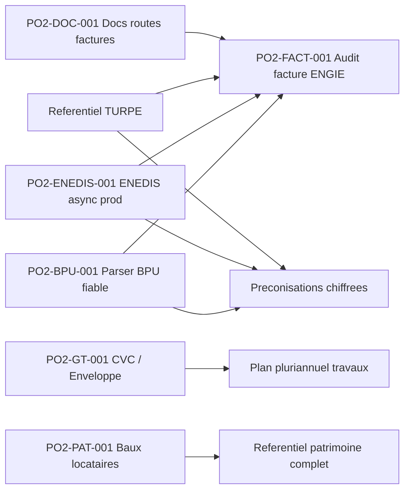

# Backlog operationnel Po2

> Role : transformer la roadmap en liste de taches pilotables.
> Regle : la roadmap decrit la vision produit ; ce fichier decide quoi faire ensuite, dans quel ordre, et pourquoi.

## Contrainte de travail

Le poste utilisateur est un ordinateur entreprise : aucune installation locale de bibliotheques Python, Node, npm, outils systeme ou dependances projet ne doit etre supposee.

Consequences :

- ne pas demander a l'utilisateur d'installer `pytest`, `npm`, `pip`, `node`, `pdfplumber`, Docker ou autres dependances ;
- les validations doivent passer par GitHub Actions, Codespaces si disponible, VPS, conteneurs existants, ou l'environnement Codex quand il fournit deja les outils ;
- toute nouvelle dependance doit etre ajoutee au repo (`requirements.txt`, `package.json`, Dockerfile, CI), jamais seulement installee sur le poste utilisateur ;
- Obsidian sert de cockpit projet, pas d'environnement d'execution.

## Vue priorisee

| ID | Chantier | Statut | Priorite | Depend de | Debloque | Prochaine action |
|---|---|---|---|---|---|---|
| PO2-BPU-001 | Parser BPU automatique | En pause | P2 | (depriorise au profit de PO2-BPU-002) | Audit factures, preconisations chiffrees | Pause : strategie schema-on-read jugee plus fiable que parser auto. Resultat atteint : 65 prix sur 2 BPU OK. Reprise possible apres PO2-BPU-002 si gain a aller chercher sur certains PDFs. |
| PO2-BPU-002 | Ingestion donnees BPU canoniques (xlsx) | En cours | P0 | xlsx d'extraction manuelle deja produit | Donnees BPU completes et fiables sur les 17 BPU | xlsx canonique livre par l'utilisateur (extraction_tarifs_electricite_BPU.xlsx, 173 prix + 9 charges). Import via `docker exec infra-backend-1 python -m app.scripts.import_bpu_xlsx --force`. Resultat en BDD avec extraction_status=manual. |
| PO2-BPU-003 | UI tableau editable BPU dans /energie/bpu | Pret a demarrer | P1 | PO2-BPU-002 (donnees en BDD) | Edition manuelle des prix BPU sans passer par xlsx | Sous-onglet "Edition" dans la page /energie/bpu, tableau plain Tailwind cliquable + sauvegarde par bouton. Endpoints CRUD a creer sur les 5 tables BPU. Effort estime 5-8h. |
| PO2-ENEDIS-001 | ENEDIS async prod operationnel | Bloque | P0 | 1753 demandes "fantomes" cote ENEDIS (HTTP 400 anti-doublon) + attente publication FTP | Backfill profond, controles conso, preconisations robustes | Cle AES alignee sur le portail (session 2026-05-19). FTP password cote VPS = portail. Reste : attendre que ENEDIS publie OU contacter support pour purger les 1753 dossiers `requested` (oldest = 2026-05-18 11:50). Aucun nouveau backfill possible tant que les fantomes existent. |
| PO2-FACT-001 | Audit facture ENGIE complet | Todo | P1 | PO2-BPU-001, TURPE, ENEDIS | Decision facture fiable | Aligner controles avec `saas/specs/05_matrice_controles_factures_energie.md` |
| PO2-DOC-001 | Corriger docs routes factures | Fait | P1 | Aucun | Handoff IA fiable | Routes API facture clarifiees : `/api/billing/invoices/imports/*`; routes frontend conservees : `/energie/factures/*` |
| PO2-GT-001 | Scinder CVC / Enveloppe | Todo | P1 | Referentiel SYPEMI existant | Gestion technique plus lisible | Ajouter filtre ou onglets dans `BuildingTechniquePage` |
| PO2-PAT-001 | Baux locataires | Todo | P2 | Choix schema Lease | Patrimoine complet possede/loue | Creer ADR schema `Lease` puis implementation |
| PO2-GRDF-001 | Connecteur GRDF gaz | Todo | P2 | Docs API GRDF | Conso gaz + audit gaz | Recuperer specs GRDF et calquer architecture ENEDIS |
| PO2-SUEZ-001 | Parser SUEZ eau | Todo | P2 | Exemples PDF SUEZ | Conso eau + audit eau | Obtenir 1-2 factures exemples, definir modele eau |
| PO2-OCC-001 | Occupation batiments | Todo | P3 | Modele occupation | Analyse hors presence | Creer modele `BuildingOccupancy` et import Excel MVP |
| PO2-TEMP-001 | Temperature / programmation CVC | Todo | P3 | Source donnee a choisir | Diagnostic chauffage | Cadrer source : Excel, GTB, IoT ou saisie manuelle |

## Dependances principales

## Definition des statuts

| Statut | Signification |
|---|---|
| Todo | Pas commence ou seulement cadre en documentation |
| En cours | Code ou action externe deja initiee |
| Bloque | Attend une action utilisateur, fournisseur, secret, acces ou decision |
| Fait | Livre, verifie et documente |
| Archive | Abandonne ou remplace |

## Regle de mise a jour

A chaque session :

1. mettre a jour ce fichier si une priorite change ;
2. mettre a jour `docs/04-Etat-actuel-du-dev.md` si l'etat reel du code/prod change ;
3. creer une note dans `docs/Sessions/` ;
4. creer une ADR dans `docs/Decisions/` si le choix engage le futur.
