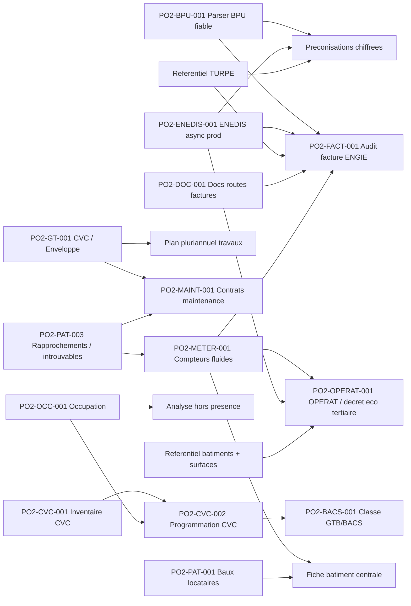

# Backlog operationnel Po2

> Role : transformer la roadmap en liste de taches pilotables.
> Regle : la roadmap decrit la vision produit ; ce fichier decide quoi faire ensuite, dans quel ordre, et pourquoi.

## Contrainte de travail

Le poste utilisateur est un ordinateur entreprise : aucune installation locale de bibliotheques Python, Node, npm, outils systeme ou dependances projet ne doit etre supposee.

Consequences :

- ne pas demander a l'utilisateur d'installer `pytest`, `npm`, `pip`, `node`, `pdfplumber`, Docker ou autres dependances ;
- les validations doivent passer par GitHub Actions, Codespaces si disponible, VPS, conteneurs existants, ou l'environnement Codex quand il fournit deja les outils ;
- toute nouvelle dependance doit etre ajoutee au repo (`requirements.txt`, `package.json`, Dockerfile, CI), jamais seulement installee sur le poste utilisateur ;
- Obsidian sert de cockpit projet, pas d'environnement d'execution.

## Vue priorisee

| ID | Chantier | Statut | Priorite | Depend de | Debloque | Prochaine action |
|---|---|---|---|---|---|---|
| PO2-AUDIT-001 | Inventaire complet des fonctionnalites developpees | Fait | P0 | Lecture code + vault | Arbitrages de simplification fiables | Livre 2026-06-02 : `docs/08-Inventaire-fonctionnalites-developpees-2026-06-02.md`. Cartographie code reel, recouvrements BPU/CVC/CPE, APIs non cablees, candidats au retrait et ordre de consolidation. |
| PO2-AUDIT-002 | Arbitrer les recouvrements et retirer le code confirme inutile | Todo | P2 | PO2-AUDIT-001, validation utilisateur, verification prod | Navigation et maintenance simplifiees | Decider `bpu_*` vs `BillingBpuLine`, `CvcInventoryItem` vs `BuildingEquipment`, avenir du proxy `/api/engie/*`, puis retirer progressivement uniquement le code confirme sans usage. |
| PO2-BPU-001 | Parser BPU automatique | En pause | P2 | (depriorise au profit de PO2-BPU-002) | Audit factures, preconisations chiffrees | Pause : strategie schema-on-read jugee plus fiable que parser auto. Resultat atteint : 65 prix sur 2 BPU OK. Reprise possible apres PO2-BPU-002 si gain a aller chercher sur certains PDFs. |
| PO2-BPU-002 | Ingestion donnees BPU canoniques (xlsx) | Fait | P0 | xlsx d'extraction manuelle deja produit | Donnees BPU completes et fiables sur les 17 BPU | Livre 2026-05-20. 17 docs / 49 segments / 138 periodes / 523 composantes / 36 charges en BDD (extraction_status=manual). Script : `app.scripts.import_bpu_xlsx`. |
| PO2-BPU-003 | UI tableau editable BPU dans /energie/bpu | Fait | P1 | PO2-BPU-002 (donnees en BDD) | Edition manuelle des prix BPU sans passer par xlsx | Livre 2026-05-20. Sous-onglet "Edition" dans /energie/bpu : BpuEditableTable (~280 lignes), 14 endpoints CRUD backend (GET editable-rows + PATCH/POST/DELETE sur les 5 tables), batch save, badge modifs non enregistrees, filtres supplier/annee. Commit 0e32a1c. |
| PO2-BPU-004 | Historique TURPE dans /energie/bpu | Fait | P1 | Referentiel CRE TURPE 6/7 | Lecture evolution acheminement reglemente avec les prix BPU | Livre 2026-05-20. Nouvel endpoint `/api/bpu/turpe-evolution` + sous-onglet "TURPE" dans `/energie/bpu`, base 100 au 2021-08-01, points CRE 2021-2025 et liens sources. |
| PO2-ENEDIS-001 | ENEDIS async prod operationnel | Bloque | P0 | 1753 demandes "fantomes" cote ENEDIS (HTTP 400 anti-doublon) + attente publication FTP | Backfill profond, controles conso, preconisations robustes | Cle AES alignee sur le portail (session 2026-05-19). FTP password cote VPS = portail. Reste : attendre que ENEDIS publie OU contacter support pour purger les 1753 dossiers `requested` (oldest = 2026-05-18 11:50). Aucun nouveau backfill possible tant que les fantomes existent. |
| PO2-FACT-001 | Audit facture ENGIE complet + socle historique EDF | En cours | P1 | BPU, TURPE, ENEDIS, lot historique ENGIE | Decision facture fiable + historique depenses/tarifs | XLSX ENGIE prioritaire : import asynchrone, upsert avec preservation decisions, controle BPU/TURPE/ENEDIS, rapport fournisseur filtre, suivi mensuel conso facturee vs ENEDIS + couverture factures/PRM. 9 filtres facettes livres (commit `9b2c8ca`) : mois, PRM/PCE, FIC, site, commune, segment, code tarif, libelle tarif, type document — avec correction graphe mensuel per-site. Controle local 2026-06-09 : `MesFactures_20260609132103.xlsx` vs `extraction_tarifs_electricite_BPU.xlsx` source canonique, ENGIE Lot 1 2026 = 5 996 lignes tarifaires controlees, 0 ecart, 0 reference manquante. Le moteur charge maintenant le BPU courant par fournisseur depuis le xlsx canonique pour eviter les faux positifs de mauvais lot/configuration. Prochaine marche : deploy, reimport XLSX avec force update, puis valider la fiche liaison finance sur quelques bordereaux representatifs. |
| PO2-CPE-001 | Controle factures DALKIA CPE Ville | En cours | P0 | Matrice codification DALKIA, export finances DALKIA, DPGF Lot 1, indices P2/P3 | Fiche liaison finance fiable, validation/refus facture, suivi P1/P2/P3, consommations multi-fluides | Socle finance livre + conso multi-fluides livre : import DALKIA detaille GAZ/ELEC/ECS/EAU/CHALEUR, fiche site, synthese portefeuille `/cpe`, codes DALKIA non rattaches conserves. Prochaine marche : reimporter le CSV reel, rattacher les codes piscines/non alignes, puis parser/versionner les enveloppes DPGF Lot 1/Lot 2 pour obtenir le realise / prevu par famille et poste. Voir `energie/CPE-DALKIA/16-Pilotage-financier-et-controle-global.md`. |
| PO2-CPE-002 | Refonte Formules et indices CPE | En cours | P0 | Migration 0030, controles P2/P3, workflow PDF livre | Referentiel contradictoire fiable et centralise | Increment 1 livre : migration additive 0031, preuves PDF reutilisables sans facture obligatoire, table de liaison multi-factures, import centralise, fiches P1/P2/P3 et registre justificatifs. Reste : historique des statuts, liaisons visibles, rattachement formule/version, recalcul automatique des factures affectees et validation officielle explicite. Voir `energie/CPE-DALKIA/15-Formules-indices-et-travaux-P3.md`. |
| PO2-CPE-003 | Validation demandes travaux P3 DALKIA et BPU | Todo | P0 | PO2-CPE-002, annexes 7 BPU Lot 1 et Lot 2 | Controle reactif des devis, engagements P3, bon pour accord | Parser et versionner le BPU DALKIA, afficher le catalogue, creer le registre de demandes, qualifier P3/P3.4/BPU hors forfait/urgence, recalculer prix et coefficients, suivre compte P3, ouvrir un espace fournisseur cloisonne puis notifier le controleur et envoyer la decision. Voir `energie/CPE-DALKIA/15-Formules-indices-et-travaux-P3.md`. |
| PO2-DOC-001 | Corriger docs routes factures | Fait | P1 | Aucun | Handoff IA fiable | Routes API facture clarifiees : `/api/billing/invoices/imports/*`; routes frontend conservees : `/energie/factures/*` |
| PO2-PAT-002 | Import patrimoine hierarchique site/batiment/local | En cours | P1 | Fichier inventaire avec colonne Typologie | Referentiel patrimonial maitre pour Energie, CPE, maintenance et occupation | Modele durable implemente : table `sites`, `buildings.site_id`, endpoints `/api/buildings/sites`, import qui cree/reutilise les sites puis rattache batiments et locaux. Reste a tester l'import reel et a rendre Site/Batiment/Local consultables comme referents de rattachement. |
| PO2-PAT-003 | Rapprochements patrimoine et objets non identifies | Todo | P0 | PO2-PAT-002 teste, sources ENEDIS/CPE disponibles | Attacher PRM/PCE/CPE/contrats sans perdre les introuvables | Creer une boite de rapprochement : chaque objet externe garde source, libelle, identifiant, candidat Site/Batiment/Local, score/confiance, statut `a_traiter/lie/ignore/a_creer`. Aucun objet introuvable ne doit disparaitre. |
| PO2-GT-001 | Scinder CVC / Enveloppe | Todo | P1 | Referentiel SYPEMI existant | Gestion technique plus lisible | Ajouter filtre ou onglets dans `BuildingTechniquePage` |
| PO2-METER-001 | Rattachement compteurs fluides aux batiments | En cours | P1 | Referentiel Site/Batiment/Local, PO2-PAT-003, donnees ENEDIS, futurs GRDF/SUEZ | Fiche batiment centrale, audit conso par patrimoine, OPERAT | Socle manuel livre sur `Building`. Prochaine etape : faire passer PRM ENEDIS et PCE GRDF/CPE par le rapprochement patrimoine, puis decider si le lien compteur cible seulement `Building` ou tout referent Site/Batiment/Local. |
| PO2-CVC-001 | Import inventaire materiels CVC terrain | En cours | P1 | `saas/CVC/listing materiels V2.xlsx`, referentiel SYPEMI | Fiche technique batiment, maintenance, BACS futur | Reouvert 2026-06-04 : flux recadre en 2 boutons upload/preview puis enregistrer, page dediee `/buildings/cvc-import/sites` pour matcher les sites importes avec le patrimoine et appliquer Site/Batiment en masse, puis tableau inventaire pleine largeur pour affiner Local, reference `equipment_references`, durees de vie et fluide frigorigene. Validation backend `compileall` OK ; validation frontend a faire via CI faute de npm local. |
| PO2-OPERAT-001 | Connexion OPERAT / decret eco tertiaire | Todo | P1 | Batiments tertiaires, surfaces, consommations annuelles, acces OPERAT | Suivi reglementaire EET, objectifs 2030/2040/2050, exports/API | Cadrer les modalites API OPERAT avec ADEME/OPERAT et creer un modele EFA/assujettissement. MVP conseille : tableau de conformite + export annuel avant connexion API. |
| PO2-MAINT-001 | Contrats de maintenance multi-batiments | Todo | P1 | Patrimoine + gestion technique | Suivi prestataires, lots, echeances, couts, affectation aux batiments/equipements | Creer ADR modele `MaintenanceContract` + table d'affectation batiments/equipements, puis MVP CRUD + upload PDF + alertes echeance. |
| PO2-UX-001 | Reorganiser la navigation metier | En cours | P1 | Inventaire transversal livre ; rapprochements patrimoine a stabiliser | Interface plus lisible | Cadrage UX documente dans `docs/09-Vision-produit-et-navigation-UX.md` : 6 domaines, sous-navigation contextuelle, imports experts regroupes dans Administration et parcours prioritaires. Prochaine marche : arbitrer les 5 decisions UX avec l'utilisateur puis implementer la phase 1 sans casser les routes existantes. |
| PO2-PAT-001 | Baux locataires | Todo | P2 | Choix schema Lease | Patrimoine complet possede/loue | Creer ADR schema `Lease` puis implementation |
| PO2-GRDF-001 | Connecteur GRDF gaz | Todo | P2 | Docs API GRDF, premiers PCE rattaches | Conso gaz + audit gaz | Demarrer par import CSV/XLSX GRDF sur PCE puis calquer l'architecture ENEDIS pour l'API. |
| PO2-SUEZ-001 | Parser SUEZ eau | Todo | P2 | Exemples PDF SUEZ | Conso eau + audit eau | Obtenir 1-2 factures exemples, definir modele eau |
| PO2-OCC-001 | Import occupation batiments | Todo | P2 | `saas/CVC/PF - Annexe n°9 - Occupation des bâtiments.xlsx`, modele occupation | Analyse hors presence, planning usagers | Creer modele `BuildingOccupancy` puis importer les colonnes Code/Nom/Lot/Occupation/Nettoyage/Fermetures/Responsable/Tel/Mail. |
| PO2-OCC-002 | Portail usagers planning occupation | Todo | P3 | PO2-OCC-001, comptes/roles usagers | Planning vivant, donnees terrain tenues a jour | Permettre aux responsables/usagers de modifier les horaires avec historique, date d'effet, commentaire et statut de validation. |
| PO2-OCC-003 | Alertes modification occupation | Todo | P3 | PO2-OCC-002, preference destinataire | Gouvernance des changements d'usage | Alerter un tiers final/referent patrimoine-energie quand un planning est modifie ou soumis. |
| PO2-CVC-002 | Temperature / programmation CVC | Todo | P3 | PO2-CVC-001, PO2-OCC-001 | Diagnostic chauffage, detection surchauffe/hors presence | Modeliser consignes, temperatures depart, regimes confort/reduit, programmation chaudiere/CTA/PAC par zone et periode. |
| PO2-BACS-001 | Evaluation GTB / decret BACS via NF EN ISO 52120 | Futur | P4 | PO2-CVC-001, PO2-CVC-002, tableau 6 ISO 52120 structure | Classe GTB/BAC A/B/C/D, trajectoire BACS | Transformer `saas/CVC/TABLEAU 6 NORME NF EN ISO 52120.pdf` en table de donnees : typologie de regulation selectionnee -> classe estimee, applicabilite, preuve et niveau de confiance. |

## Dependances principales

## Definition des statuts

| Statut | Signification |
|---|---|
| Todo | Pas commence ou seulement cadre en documentation |
| En cours | Code ou action externe deja initiee |
| Bloque | Attend une action utilisateur, fournisseur, secret, acces ou decision |
| Fait | Livre, verifie et documente |
| Archive | Abandonne ou remplace |
| Futur | Chaine de valeur identifiee mais a ne pas demarrer avant les dependances |

## Regle de mise a jour

A chaque session :

1. mettre a jour ce fichier si une priorite change ;
2. mettre a jour `docs/04-Etat-actuel-du-dev.md` si l'etat reel du code/prod change ;
3. creer une note dans `docs/Sessions/` ;
4. creer une ADR dans `docs/Decisions/` si le choix engage le futur.
