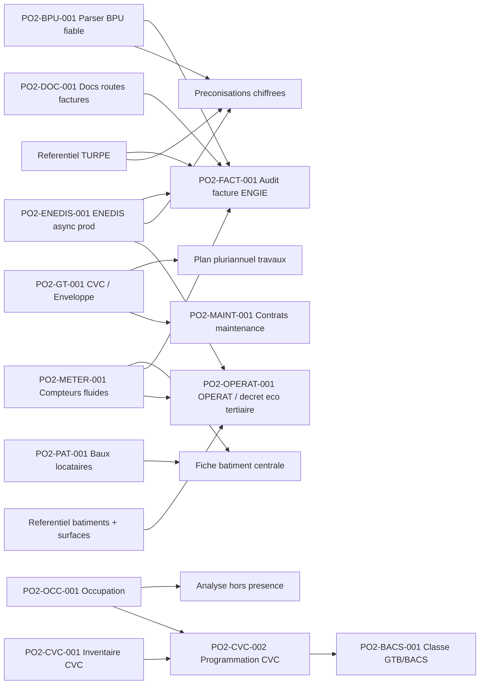

# Backlog operationnel Po2

> Role : transformer la roadmap en liste de taches pilotables.
> Regle : la roadmap decrit la vision produit ; ce fichier decide quoi faire ensuite, dans quel ordre, et pourquoi.

## Contrainte de travail

Le poste utilisateur est un ordinateur entreprise : aucune installation locale de bibliotheques Python, Node, npm, outils systeme ou dependances projet ne doit etre supposee.

Consequences :

- ne pas demander a l'utilisateur d'installer `pytest`, `npm`, `pip`, `node`, `pdfplumber`, Docker ou autres dependances ;
- les validations doivent passer par GitHub Actions, Codespaces si disponible, VPS, conteneurs existants, ou l'environnement Codex quand il fournit deja les outils ;
- toute nouvelle dependance doit etre ajoutee au repo (`requirements.txt`, `package.json`, Dockerfile, CI), jamais seulement installee sur le poste utilisateur ;
- Obsidian sert de cockpit projet, pas d'environnement d'execution.

## Vue priorisee

| ID | Chantier | Statut | Priorite | Depend de | Debloque | Prochaine action |
|---|---|---|---|---|---|---|
| PO2-BPU-001 | Parser BPU automatique | En pause | P2 | (depriorise au profit de PO2-BPU-002) | Audit factures, preconisations chiffrees | Pause : strategie schema-on-read jugee plus fiable que parser auto. Resultat atteint : 65 prix sur 2 BPU OK. Reprise possible apres PO2-BPU-002 si gain a aller chercher sur certains PDFs. |
| PO2-BPU-002 | Ingestion donnees BPU canoniques (xlsx) | Fait | P0 | xlsx d'extraction manuelle deja produit | Donnees BPU completes et fiables sur les 17 BPU | Livre 2026-05-20. 17 docs / 49 segments / 138 periodes / 523 composantes / 36 charges en BDD (extraction_status=manual). Script : `app.scripts.import_bpu_xlsx`. |
| PO2-BPU-003 | UI tableau editable BPU dans /energie/bpu | Fait | P1 | PO2-BPU-002 (donnees en BDD) | Edition manuelle des prix BPU sans passer par xlsx | Livre 2026-05-20. Sous-onglet "Edition" dans /energie/bpu : BpuEditableTable (~280 lignes), 14 endpoints CRUD backend (GET editable-rows + PATCH/POST/DELETE sur les 5 tables), batch save, badge modifs non enregistrees, filtres supplier/annee. Commit 0e32a1c. |
| PO2-BPU-004 | Historique TURPE dans /energie/bpu | Fait | P1 | Referentiel CRE TURPE 6/7 | Lecture evolution acheminement reglemente avec les prix BPU | Livre 2026-05-20. Nouvel endpoint `/api/bpu/turpe-evolution` + sous-onglet "TURPE" dans `/energie/bpu`, base 100 au 2021-08-01, points CRE 2021-2025 et liens sources. |
| PO2-ENEDIS-001 | ENEDIS async prod operationnel | Bloque | P0 | 1753 demandes "fantomes" cote ENEDIS (HTTP 400 anti-doublon) + attente publication FTP | Backfill profond, controles conso, preconisations robustes | Cle AES alignee sur le portail (session 2026-05-19). FTP password cote VPS = portail. Reste : attendre que ENEDIS publie OU contacter support pour purger les 1753 dossiers `requested` (oldest = 2026-05-18 11:50). Aucun nouveau backfill possible tant que les fantomes existent. |
| PO2-FACT-001 | Audit facture ENGIE complet | Todo | P1 | PO2-BPU-001, TURPE, ENEDIS | Decision facture fiable | Aligner controles avec `saas/specs/05_matrice_controles_factures_energie.md` |
| PO2-DOC-001 | Corriger docs routes factures | Fait | P1 | Aucun | Handoff IA fiable | Routes API facture clarifiees : `/api/billing/invoices/imports/*`; routes frontend conservees : `/energie/factures/*` |
| PO2-GT-001 | Scinder CVC / Enveloppe | Todo | P1 | Referentiel SYPEMI existant | Gestion technique plus lisible | Ajouter filtre ou onglets dans `BuildingTechniquePage` |
| PO2-METER-001 | Rattachement compteurs fluides aux batiments | Todo | P1 | Referentiel batiments, donnees ENEDIS, futurs GRDF/SUEZ | Fiche batiment centrale, audit conso par batiment, OPERAT | Creer modele `BuildingMeterLink` multi-fluides avec dates de validite, compteur partage, cle de repartition et niveau de confiance. |
| PO2-CVC-001 | Import inventaire materiels CVC terrain | Fait | P1 | `saas/CVC/listing materiels V2.xlsx`, referentiel SYPEMI | Fiche technique batiment, maintenance, BACS futur | Livre 2026-05-20. Nouvelle table `cvc_inventory_items` (migration 0016) + service fuzzy-match (sites↔batiments, famille↔SYPEMI) + wizard import 3 etapes (`/buildings/cvc-import`) + onglet "Inventaire terrain" dans `/buildings/technique` avec badges vetuste/criticite. Commit fd192fe. |
| PO2-OPERAT-001 | Connexion OPERAT / decret eco tertiaire | Todo | P1 | Batiments tertiaires, surfaces, consommations annuelles, acces OPERAT | Suivi reglementaire EET, objectifs 2030/2040/2050, exports/API | Cadrer les modalites API OPERAT avec ADEME/OPERAT et creer un modele EFA/assujettissement. MVP conseille : tableau de conformite + export annuel avant connexion API. |
| PO2-MAINT-001 | Contrats de maintenance multi-batiments | Todo | P1 | Patrimoine + gestion technique | Suivi prestataires, lots, echeances, couts, affectation aux batiments/equipements | Creer ADR modele `MaintenanceContract` + table d'affectation batiments/equipements, puis MVP CRUD + upload PDF + alertes echeance. |
| PO2-PAT-001 | Baux locataires | Todo | P2 | Choix schema Lease | Patrimoine complet possede/loue | Creer ADR schema `Lease` puis implementation |
| PO2-GRDF-001 | Connecteur GRDF gaz | Todo | P2 | Docs API GRDF | Conso gaz + audit gaz | Recuperer specs GRDF et calquer architecture ENEDIS |
| PO2-SUEZ-001 | Parser SUEZ eau | Todo | P2 | Exemples PDF SUEZ | Conso eau + audit eau | Obtenir 1-2 factures exemples, definir modele eau |
| PO2-OCC-001 | Import occupation batiments | Todo | P2 | `saas/CVC/PF - Annexe n°9 - Occupation des bâtiments.xlsx`, modele occupation | Analyse hors presence, planning usagers | Creer modele `BuildingOccupancy` puis importer les colonnes Code/Nom/Lot/Occupation/Nettoyage/Fermetures/Responsable/Tel/Mail. |
| PO2-OCC-002 | Portail usagers planning occupation | Todo | P3 | PO2-OCC-001, comptes/roles usagers | Planning vivant, donnees terrain tenues a jour | Permettre aux responsables/usagers de modifier les horaires avec historique, date d'effet, commentaire et statut de validation. |
| PO2-OCC-003 | Alertes modification occupation | Todo | P3 | PO2-OCC-002, preference destinataire | Gouvernance des changements d'usage | Alerter un tiers final/referent patrimoine-energie quand un planning est modifie ou soumis. |
| PO2-CVC-002 | Temperature / programmation CVC | Todo | P3 | PO2-CVC-001, PO2-OCC-001 | Diagnostic chauffage, detection surchauffe/hors presence | Modeliser consignes, temperatures depart, regimes confort/reduit, programmation chaudiere/CTA/PAC par zone et periode. |
| PO2-BACS-001 | Evaluation GTB / decret BACS via NF EN ISO 52120 | Futur | P4 | PO2-CVC-001, PO2-CVC-002, tableau 6 ISO 52120 structure | Classe GTB/BAC A/B/C/D, trajectoire BACS | Transformer `saas/CVC/TABLEAU 6 NORME NF EN ISO 52120.pdf` en table de donnees : typologie de regulation selectionnee -> classe estimee, applicabilite, preuve et niveau de confiance. |

## Dependances principales

## Definition des statuts

| Statut | Signification |
|---|---|
| Todo | Pas commence ou seulement cadre en documentation |
| En cours | Code ou action externe deja initiee |
| Bloque | Attend une action utilisateur, fournisseur, secret, acces ou decision |
| Fait | Livre, verifie et documente |
| Archive | Abandonne ou remplace |
| Futur | Chaine de valeur identifiee mais a ne pas demarrer avant les dependances |

## Regle de mise a jour

A chaque session :

1. mettre a jour ce fichier si une priorite change ;
2. mettre a jour `docs/04-Etat-actuel-du-dev.md` si l'etat reel du code/prod change ;
3. creer une note dans `docs/Sessions/` ;
4. creer une ADR dans `docs/Decisions/` si le choix engage le futur.
