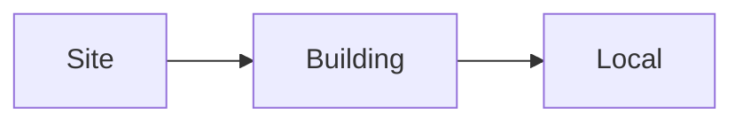
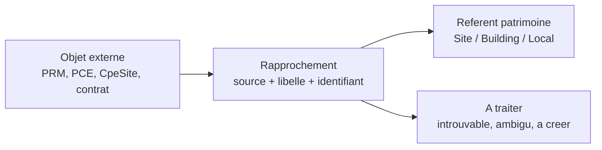

# Module — Patrimoine

> Inventaire des bâtiments et locaux possédés ou loués par la collectivité.

## Périmètre

| Fonctionnalité roadmap | Statut |
|---|---|
| 1.1 Inventaire bâtiment propriétaire (DGFIP open data) | ✅ Fait |
| 1.2 Inventaire bâtiment locataire (baux PDF) | 🔴 Todo |
| 2.6 Rattachement compteurs fluides aux bâtiments | 🟡 En cours : socle manuel bâtiment, rapprochement multi-sources à faire |

## Modèle de données

### Hiérarchie patrimoine durable

Le référentiel patrimoine conserve maintenant trois niveaux métier :



- `Site` regroupe un ensemble patrimonial identifié dans les listings importés (`site`, domaine, groupe scolaire, ensemble immobilier, etc.).
- `Building` reste l'entité bâtie centrale de Po2. Il porte `site_id` quand un rattachement durable au site est connu.
- `Local` reste une sous-unité rattachée à un bâtiment par `building_id`.
- Une ligne importée `SITE` ne doit plus être aplatie en bâtiment seulement pour préserver son nom dans le référentiel.
- Une ligne importée `BATIMENT` doit être rattachée au `Site` parent quand la colonne source `Parent` le permet.
- Une ligne importée `LOCAL` doit être créée sous son bâtiment parent ; le site est retrouvé indirectement par le bâtiment.

La relation est volontairement simple : `Site -> Building -> Local`. Elle devient le **référentiel patrimonial maître** : à terme les compteurs, sites CPE, contrats de maintenance, occupations et équipements doivent s'y rattacher ou rester explicitement dans une file "non rapproché".

Les vues de consultation affichent encore surtout le bâtiment comme point d'entrée principal. Cela ne suffit plus pour la prochaine étape : il faudra pouvoir rechercher et choisir un référent de rattachement parmi les trois niveaux `Site`, `Building` et `Local`, sans aplatir la hiérarchie.

### `Site` (`saas/backend/app/models/site.py`)
Niveau parent du référentiel patrimoine. Champs principaux : `id`, `city_id`, `nom_site`, `adresse`, `source_file`, `source_rows_json`, timestamps.

### `Building` (`saas/backend/app/models/building.py`)
Champs principaux : `id`, `city_id`, `site_id`, `dgfip_*` (source MAJIC), `ign_*` (source IGN), `osm_*` (source OSM), géométrie PostGIS, `nom`, `adresse`, `code_postal`, etc.

### `Local` (`saas/backend/app/models/local.py`)
Sous-unités d'un bâtiment (étages, locaux séparés). Lié à `Building.id`.

### `City` (`saas/backend/app/models/city.py`)
Scope tenant — chaque `User` et `Building` a un `city_id`.

## Vision cible — fiche bâtiment centrale

Le bâtiment doit devenir le point de vérité métier de Po2. À terme, une fiche bâtiment doit centraliser :

- l'identité patrimoniale : nom, adresse, surfaces, locaux, propriétaire/locataire ;
- les compteurs fluides : électricité (PRM/PDL), gaz (PCE), eau ;
- les consommations et factures associées ;
- les plannings d'occupation, nettoyage, fermetures et contacts responsables ;
- les équipements CVC/enveloppe, l'état santé et les contrats de maintenance ;
- les programmations CVC et consignes ;
- les statuts réglementaires : OPERAT, BACS/GTB.

Cette vision évite que l'énergie, la technique et l'occupation restent dans des silos séparés.

## Rattachement compteurs — modèle cible

Ne pas modéliser "1 bâtiment = 1 compteur". Les cas réels à gérer :

- un bâtiment avec plusieurs compteurs ;
- un compteur partagé entre plusieurs bâtiments ;
- un compteur qui alimente une chaufferie, une annexe, un logement ou de l'éclairage extérieur ;
- un rattachement valable seulement sur une période donnée ;
- un rattachement certain, probable ou à vérifier.

Objet déjà posé : `BuildingMeterLink`, relation V1 entre `Building` et un compteur fluide, avec `fluid`, identifiant compteur, dates de validité, usage, clé de répartition, source et niveau de confiance.

Ce socle est utile pour les premiers liens manuels, mais il ne couvre pas encore toute la cible exprimée le 2026-05-22 :

- un PRM/PDL électricité peut correspondre au nom d'un `Building`, d'un `Site` ou être un usage technique à arbitrer ;
- le gaz doit utiliser le vocabulaire `PCE` GRDF (le `PDL` reste un terme souvent employé côté électricité) ;
- un site CPE DALKIA est aujourd'hui une entité contractuelle `CpeSite` séparée du référentiel patrimoine ;
- les contrats de maintenance devront être affectables au patrimoine sans créer une deuxième liste de bâtiments.

Avant d'étendre aveuglément `BuildingMeterLink`, il faut poser le workflow de rapprochement commun.

## Rapprochement multi-sources et non identifiés

### Ce qui existe déjà dans le code

| Source | Ce qui est disponible | Limite actuelle |
|---|---|---|
| Patrimoine | Hiérarchie `Site -> Building -> Local`, import hiérarchique et fiches bâtiment | Les écrans de liste restent centrés sur `Building`; pas de sélecteur transversal Site/Bâtiment/Local |
| ENEDIS | PRM, adresses, noms issus des contrats ENEDIS (`0_organization_commercial_name` / `0_organization_name`) affichés dans `/energie` | Aucun rapprochement PRM -> référent patrimoine |
| Compteurs | `BuildingMeterLink` avec identifiant et contexte fournisseur/contrat | V1 rattachée à `Building` uniquement; pas de console de rapprochement |
| CPE DALKIA | `CpeSite` avec `nom_site`, `code_site`, `pce`, relevés gaz et prix P1 | Site CPE séparé du `Site/Building/Local` patrimoine |
| Maintenance | Modèle cible documenté dans [[Modules/Maintenance-Contrats]] | Pas encore de code ni de rattachement patrimoine |

### Boîte de rapprochement recommandée

Chaque source externe qui contient un lieu ou un compteur doit pouvoir être importée sans forcer un faux lien. Les objets non rapprochés deviennent du travail à traiter, pas de la donnée perdue.

Modèle conceptuel recommandé pour le prochain chantier :



Champs minimaux à prévoir sur cette boîte :

- source et type d'objet (`enedis_prm`, `grdf_pce`, `cpe_site`, `maintenance_contract_scope`) ;
- identifiant source stable et libellé source ;
- adresse ou contexte disponible ;
- référent cible polymorphe `site_id` / `building_id` / `local_id` avec un seul niveau choisi ;
- statut `a_traiter`, `lie`, `ambigu`, `a_creer`, `ignore` ;
- score de rapprochement, niveau de confiance, utilisateur/date de validation et note.

Un statut `a_creer` doit signaler une lacune du patrimoine de référence : le bâtiment/site/local n'est pas ignoré, il attend identification puis création ou correction dans la liste maître.

## Ordre d'action recommandé

1. Tester la liste patrimoine hiérarchique actuelle et figer le vocabulaire référent `Site / Bâtiment / Local`.
2. Créer la boîte de rapprochement patrimoine avec les objets non identifiés.
3. Commencer par ENEDIS : rapprocher les PRM depuis leurs noms/adresses contractuels vers les référents patrimoine, puis alimenter les liens compteurs.
4. Brancher les `CpeSite` DALKIA sur le même rapprochement pour capitaliser leurs PCE sans dupliquer le patrimoine.
5. Faire arriver le futur module contrats de maintenance sur ce référentiel plutôt que sur une liste libre de noms de bâtiments.
6. Reprendre ensuite la navigation UI : menu plus court par domaines et fiches patrimoine plus centrales, après retour de test sur les modules déjà livrés.

## Workflows existants

### Création / import bâtiment
1. **Page** : `BuildingCreateEditPage` (multi-step)
2. **Service** : `services/building_naming.py` réconcilie un import MAJIC avec :
   - Une recherche IGN par adresse (`fetchBuildingNamingDataset`)
   - Une recherche OSM par bbox géographique
   - Une confirmation utilisateur visuelle via `BuildingNamingMap`
3. **Persistance** : création du `Building` avec tous les `*_source_id` (traçabilité)

### Import patrimoine hiérarchique
1. Le preview détecte l'onglet Excel utile et les colonnes de hiérarchie comme `Typologie` et `Parent`.
2. Les lignes `SITE` créent ou réutilisent un `Site`.
3. Les lignes `BATIMENT` créent un `Building` et renseignent `site_id` si le parent source correspond.
4. Les lignes `LOCAL` créent un `Local` sous le bâtiment parent détecté.
5. Si des locaux réels sont importés sous un bâtiment, l'import évite de créer en plus un local principal automatique.

Source de cadrage analysée : `V4_Inventaire_proprietes_SETE_DGFP_251106.xlsm`, onglet métier `Feuille_fusionnee`.

### Liste cartographique
- `BuildingsLandingPage` : vue globale carte + filtres
- `BuildingsListPage` : tableau triable
- `BuildingPortfolioMap` : Leaflet avec popups

## Pistes baux locataires (1.2)

À discuter avec utilisateur. Hypothèses de schéma :

**Option A** — Étendre `Local` :
```python
class Local(Base):
    # ... champs existants
    is_rented: Mapped[bool] = mapped_column(Boolean, default=False)
    lease_start: Mapped[date | None]
    lease_end: Mapped[date | None]
    landlord_name: Mapped[str | None]
    lease_pdf_path: Mapped[str | None]
    monthly_rent_eur: Mapped[float | None]
```
✅ Simple. ❌ Mélange propriétaire et locataire dans le même modèle.

**Option B** — Table dédiée `Lease` (relation N-1 vers Local ou Building) :
```python
class Lease(Base):
    __tablename__ = "leases"
    id: Mapped[int]
    building_id: Mapped[int]
    local_id: Mapped[int | None]  # null si bail global sur le bâtiment
    start_date, end_date, landlord_name, monthly_rent, pdf_filename, ...
```
✅ Propre, gère bien les renouvellements. ❌ Plus de complexité immédiate.

**Recommandation par défaut** : Option B (table dédiée). Permet l'historique des baux.

### Parser PDF bail
- Réutiliser l'architecture `services/bpu.py` (pdftotext + regex tolérante + OCR fallback)
- Champs à extraire : nom bailleur, dates, loyer mensuel, surface, adresse
- Stocker `raw_text` pour re-parsing futur (pattern du BPU)

## Workflow de consolidation DGFiP → bâtiment métier

> Source : `saas/specs/01_Po2_fonctionnalites.md` (spécifications fonctionnelles v0.2)

Le pattern conceptuel derrière `services/building_naming.py` :

1. **Staging DGFiP** : import brut de `source_dgfip_local` (lignes MAJIC non transformées, traçabilité 100 %)
2. **Candidat** : chaque ligne staging devient un `batiment_candidat` avec scoring de confiance (adresse normalisée + proximité IGN + recoupement OSM)
3. **Validation utilisateur** : 4 statuts métier
   - `à traiter` — candidat brut
   - `en cours` — utilisateur a commencé l'arbitrage
   - `validé` — bâtiment officiel pour la collectivité
   - `exclu` — explicitement écarté (avec motif)
4. **Bâtiment métier** : `Building` final, lié aux candidats sources via une table `batiment_source_link` (jamais d'écrasement de la donnée source)

L'implémentation actuelle simplifie ce schéma (les statuts intermédiaires ne sont pas tous matérialisés en BDD) mais le principe reste : **la source ne doit jamais être perdue**.

## Routes API

| Méthode | Route | Service |
|---|---|---|
| GET | `/api/buildings` | `list_buildings` |
| GET | `/api/buildings/{id}` | `get_building` |
| POST | `/api/buildings` | `create_building_from_naming` |
| PATCH | `/api/buildings/{id}` | `update_building` |
| POST | `/api/buildings/import/preview` | `preview_building_import_file` |
| POST | `/api/buildings/import/execute` | `execute_building_import_file` |
| GET | `/api/buildings/sites` | `list_sites` |
| POST | `/api/buildings/sites` | `create_site` |
| PUT | `/api/buildings/sites/{id}` | `update_site` |
| GET | `/api/buildings/{id}/locals` | `list_building_locals` |
| POST | `/api/buildings/{id}/locals` | `create_local` |
| GET | `/api/buildings/{id}/meters` | `list_building_meter_links` |
| POST | `/api/buildings/{id}/meters` | `create_building_meter_link` |
| GET | `/api/cities` | `list_cities` |
